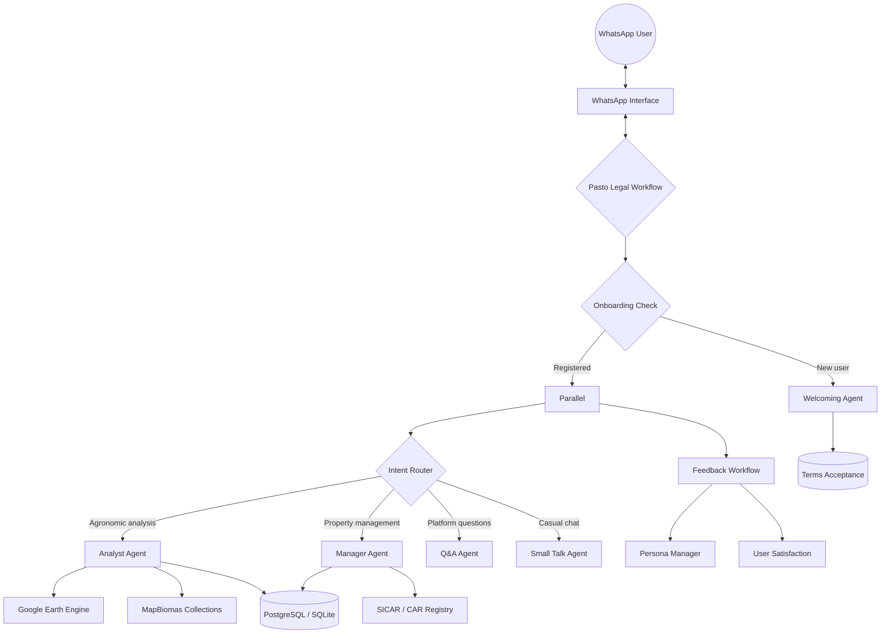

# 🌿 Pasto Legal

**AI-powered agricultural extension via WhatsApp** — delivering satellite-based pasture diagnostics, agronomic consultancy, and property management to rural producers in Brazil.

[](https://www.python.org/downloads/) [](LICENSE) []()

---

## About

Pasto Legal is an open-science platform that brings advanced satellite analytics and agronomic expertise directly to farmers' phones through WhatsApp. Behind a simple chat interface, a team of specialized AI agents connects to official databases (SICAR — Brazil's Rural Environmental Registry) and global satellites (Google Earth Engine, MapBiomas) to transform complex geospatial data into fast answers, clear maps, and precise diagnostics for rural properties.

The system is designed to be as natural as talking to a trusted agronomist — no menus, no complex navigation. Farmers can send text, audio (while standing in the field), or photos of their pasture and get actionable insights in return.

**Core capabilities:**

- 🛰️ **Pasture health monitoring** — biomass, vegetation vigor, pasture age, and land-use/cover maps derived from satellite imagery
- 🐄 **Carrying capacity calculations** — real stocking rates and ideal carrying capacity (UA/ha) using the LAPIG methodology
- 📋 **Property registration** — lookup and register properties by CAR/SICAR code, GPS coordinates, or Google Maps link
- 🌾 **Agronomic consultancy** — EMBRAPA-validated guidance on forage management, stocking rates, and pasture recovery
- 🗺️ **Thematic map generation** — biomass, soil texture, land-use, and topographic maps clipped to property boundaries
- 🔊 **Voice responses** — audio reports narrated back to the producer via WhatsApp

---

## Sponsors & Partners

Pasto Legal was born from the **Desafio IA Natureza & Clima** (AI Nature & Climate Challenge), an initiative by **iCS (Instituto Clima e Sociedade)** to promote AI solutions that generate positive socio-environmental impact in Brazil.

| Partner | Role |
|---|---|
| **LAPIG** — Laboratório de Processamento de Imagens e Geoprocessamento | Proponent and scientific nucleus — geospatial data, pasture analysis, environmental monitoring |
| **UFG** — Universidade Federal de Goiás | Academic home of LAPIG — scientific and institutional rigor |
| **Solved** | Technology partner — bridging research into accessible, user-focused software |
| **iCS** — Instituto Clima e Sociedade | Funder — creator of the Desafio IA Natureza & Clima |
| **Google.org** | Philanthropic supporter — funding AI solutions for socio-environmental challenges |
| **ITS** — Instituto de Tecnologia e Sociedade | Technical guidance — best practices, governance, and ethical AI use |

---

## Goals

Pasto Legal aligns with the directives of the Desafio IA Natureza & Clima:

- 🌱 **Regenerative agriculture** — supporting sustainable pasture management and recovery
- 💰 **Bioeconomy strengthening** — enabling data-driven decisions for rural producers
- 🦜 **Biodiversity loss reversal** — monitoring and preserving native vegetation in Brazil
- 🌍 **GHG emission mitigation** — promoting resilient ecosystems that sequester carbon
- 🔓 **Open science** — free access to geospatial data, reports, and the source code itself

---

## Architecture

Pasto Legal uses a multi-agent architecture built on the **[Agno](https://github.com/agno-agi/agno)** framework. A central workflow orchestrates greeting detection, intent routing, feedback evaluation, and response merging.



**Key components:**

| Component | Description |
|---|---|
| **Welcoming Agent** | Onboards new users — presents terms of use and collects acceptance |
| **Router Agent** | Classifies user intent and dispatches to the appropriate specialist |
| **Analyst Agent** | Performs agronomic analyses — pasture stats, biomass maps, soil texture, topography |
| **Manager Agent** | Handles property CRUD — registration by CAR code, coordinates, or Maps link |
| **Q&A Agent** | Answers platform usage questions using the knowledge base |
| **Small Talk Agent** | Handles greetings and casual conversation |
| **Feedback Workflow** | Evaluates user satisfaction (1–5), adapts persona, and applies remediation when needed |

---

## Tech Stack

| Layer | Technology |
|---|---|
| **Language** | Python 3.12+ |
| **Agent framework** | [Agno](https://github.com/agno-agi/agno) 2.6 |
| **LLM** | Google Gemini (`gemini-3.1-flash-lite`) — configurable to Ollama for local models |
| **TTS** | Google Gemini TTS (`gemini-3.1-flash-tts-preview`) |
| **Satellite data** | Google Earth Engine, MapBiomas Collections (biomass, LULC, vigor, pasture age), Sentinel-2, Landsat |
| **Property registry** | SICAR public API + DuckDB spatial queries on local Parquet files |
| **Web framework** | FastAPI (WhatsApp webhook) + Streamlit (web UI) |
| **Database** | PostgreSQL (prod) / SQLite (dev) via SQLAlchemy + DuckDB (geospatial) |
| **Caching / queue** | Redis / Valkey |
| **Data validation** | Pydantic v2 |

---

## Getting Started

### Prerequisites

- **[uv](https://docs.astral.sh/uv/)** — fast Python package manager
- **Google Earth Engine** service account with access to MapBiomas collections
- **Redis / Valkey** (for WhatsApp message debouncing in production)

### Installation

```bash
# Clone the repository
git clone https://github.com/lapig-ufg/pasto-legal.git
cd pasto-legal
```

### Configuration

Copy the environment template and fill in your credentials:

```bash
cp .env.example .env
```

Key environment variables (see [`.env.example`](.env.example) for the full list):

| Variable | Description |
|---|---|
| `APP_ENV` | `development`, `staging`, or `production` |
| `DATABASE_TYPE` | `sqlite` (dev) or `postgres` (prod) |
| `GEE_PROJECT` | Google Earth Engine project ID |
| `GEE_SERVICE_ACCOUNT` | GEE service account email |
| `GEE_KEY_FILE` | Path to GEE service account JSON key |
| `MODEL_PROVIDER` | `google` (Gemini) or `ollama` (local) |
| `MODEL_ID` | Model identifier (default: `gemini-3.1-flash-lite`) |
| `GOOGLE_API_KEY` | Google Gemini API key |

> **Production also requires:** PostgreSQL connection vars, WhatsApp Business API credentials (`WHATSAPP_ACCESS_TOKEN`, `WHATSAPP_VERIFY_TOKEN`, `WHATSAPP_WEBHOOK_URL`, `WHATSAPP_PHONE_NUMBER_ID`, `WHATSAPP_APP_SECRET`), and Redis/Valkey connection vars.

### Docker

```bash
docker compose up --build
```

### Running Locally

```bash
# Install dependencies
uv sync
```

**Streamlit web app:**

```bash
PYTHONPATH=. uv run streamlit run app/interfaces/streamlit/streamlit_webapp.py --server.port 8080
```

The Streamlit interface will be available at `http://localhost:8080`.

**WhatsApp bot (FastAPI server) + ngrok:**

```bash
uv run python -m app.main

ngrok http --url=<your-domain> 3000
```

---

## Project Structure

```
pasto-legal/
├── app/
│   ├── main.py                  # App entry point (AgentOS + FastAPI)
│   ├── agents/                  # AI agent definitions
│   │   ├── analyst_agent.py     # Agronomic analysis specialist
│   │   ├── manager_agent.py     # Property management agent
│   │   ├── router_agent.py      # Intent classification & routing
│   │   ├── welcoming_agent.py   # Onboarding & terms acceptance
│   │   ├── feedback_agent.py   # Satisfaction evaluation & remediation
│   │   ├── persona_agent.py    # User persona tracking
│   │   ├── question_answer_agent.py  # FAQ / knowledge base
│   │   └── small_talk_agents.py # Casual conversation
│   ├── workflows/
│   │   ├── main_workflow.py     # Root orchestration workflow
│   │   └── feedback_workflow.py # Satisfaction & persona update
│   ├── tools/                   # Agent tools (GEE, SICAR, TTS, etc.)
│   ├── interfaces/
│   │   ├── whatsapp/            # WhatsApp Business API integration
│   │   └── streamlit/          # Streamlit web UI
│   ├── configs/                 # Environment-based configuration
│   ├── database/                # SQLAlchemy models & sessions
│   ├── hooks/                   # Pre/post hooks (auth, validation)
│   ├── guardrails/              # PII detection & masking
│   ├── skills/                  # Agent skills (UA calculator, etc.)
│   └── utils/                   # GEE scripts, image processing, data models
├── docs/
│   ├── knowledge/               # Knowledge base for the Q&A agent
│   ├── release_notes/           # Version changelogs
│   └── workflow-diagrams.md     # Detailed Mermaid workflow diagrams
├── tests/
├── compose.yaml                 # Docker Compose config
├── Dockerfile                   # Container build
├── pyproject.toml               # Project metadata & dependencies
└── .env.example                 # Environment variable template
```

---

## Documentation

- **[Technical architecture & workflow](docs/README.md)** — detailed agent roles, tools, and data flow
- **[Workflow diagrams](docs/workflow-diagrams.md)** — Mermaid diagrams of the orchestration
- **[Knowledge base](docs/knowledge/)** — reference material used by the Q&A agent (Portuguese)
- **[Release notes](docs/release_notes/)** — version history

---

## License

This project is licensed under the **GNU General Public License v3.0** — see the [LICENSE](LICENSE) file for details.

We encourage others to build upon this project and create their own solutions. If you do, you **must**:

1. **Keep it open** — any derivative work must be released under an open-source and/or open-science license (copyleft).
2. **Give credit** — clearly reference and attribute **Pasto Legal**, **LAPIG**, and **UFG** in your project, documentation, and any published outputs.

> **Note:** The "Pasto Legal" brand name, logo, and visual identity are owned by **UFG/LAPIG** and may not be reproduced without prior authorization. Geospatial data used in the platform comes from public sources (Copernicus/ESA) and is subject to their respective licenses.

---

## Contact

For questions, feature requests, or to exercise data protection rights, contact: **contact@pasto.legal**