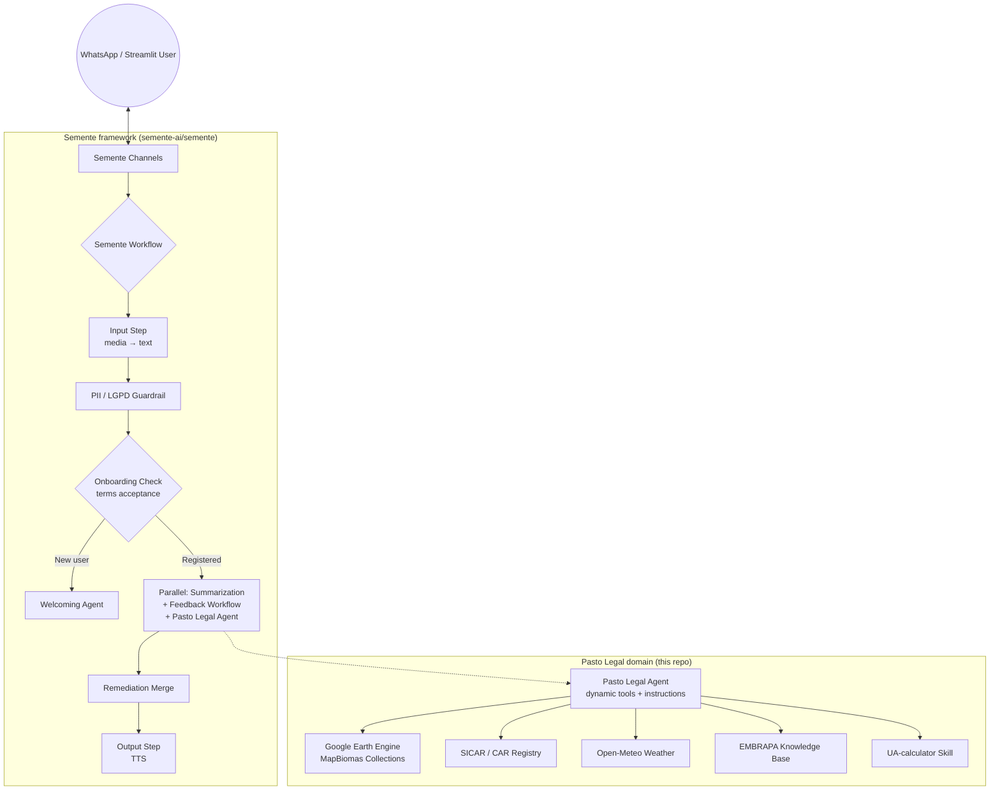

# 🌿 Pasto Legal

**AI-powered agricultural extension via WhatsApp** — delivering satellite-based pasture diagnostics, agronomic consultancy, and property management to rural producers in Brazil.

[](https://www.python.org/downloads/) [](LICENSE) []() [](#-built-on-semente-ai)

---

## About

Pasto Legal is an open-science platform that brings advanced satellite analytics and agronomic expertise directly to farmers' phones through WhatsApp. Behind a simple chat interface, a team of specialized AI agents connects to official databases (SICAR — Brazil's Rural Environmental Registry) and global satellites (Google Earth Engine, MapBiomas) to transform complex geospatial data into fast answers, clear maps, and precise diagnostics for rural properties.

The system is designed to be as natural as talking to a trusted agronomist — no menus, no complex navigation. Farmers can send text, audio (while standing in the field), or photos of their pasture and get actionable insights in return.

**Core capabilities:**

- 🛰️ **Pasture health monitoring** — biomass, vegetation vigor, pasture age, and land-use/cover maps derived from satellite imagery
- 🐄 **Carrying capacity calculations** — real stocking rates and ideal carrying capacity (UA/ha) using the LAPIG methodology
- 📋 **Property registration** — lookup and register properties by CAR/SICAR code, GPS coordinates, or Google Maps link
- 🌾 **Agronomic consultancy** — EMBRAPA-validated guidance on forage management, stocking rates, and pasture recovery
- 🗺️ **Thematic map generation** — biomass, soil texture, land-use, and topographic maps clipped to property boundaries
- 🔊 **Voice responses** — audio reports narrated back to the producer via WhatsApp

---

## 🌱 Built on Semente AI

Pasto Legal is a **[Semente](https://github.com/semente-ai/semente) app** — the first one.

[Semente](https://github.com/semente-ai/semente) ("seed" in Portuguese) is the multi-agent AI chat framework **extracted from Pasto Legal** (LAPIG/UFG). It keeps everything domain-neutral — the workflow orchestration, WhatsApp + Streamlit channels, persona/feedback loop, PII guardrails, i18n prompts, TTS — and lets any land-use assistant be grown by supplying a **domain**: tools, knowledge base, skills, and prompts.

**📖 Semente documentation:** https://semente-ai.github.io (see the [Domain API](https://semente-ai.github.io/guide/domain-api) for the surface this app consumes)

**The split:**

| Lives in **Semente** (framework) | Lives here (Pasto Legal **domain**) |
|---|---|
| Workflow orchestration (steps, conditions, parallel, router) | Pasture analysis tools (GEE, MapBiomas collections) |
| Onboarding, PII/LGPD guardrails, feedback & persona loop | Property registration tools (SICAR / CAR registry) |
| WhatsApp + Streamlit channels, message debouncing & chunking | Weather forecast tools (Open-Meteo) |
| Session store, history, summarization, TTS | EMBRAPA knowledge base (`docs/knowledge/`) |
| i18n YAML prompt loader & neutral English defaults | pt-BR domain prompts (`domain/prompts/`) |
| Engine port — swappable agent engine (Agno, ADK, bare) | UA-calculator skill |

In practice: this repository contains a `domain/` package plus a `semente.yaml` manifest. Semente assembles the entire application from them — including the engine (Agno by default), configurable via `engine:` in the manifest or the `SEMENTE_ENGINE` environment variable.

> *Pasto Legal was the first seed.* If you want to build a similar assistant for a different domain (crops, forestry, water, climate), start from [Semente](https://github.com/semente-ai/semente) — its [Echo domain](https://github.com/semente-ai/semente/tree/main/examples/echo_domain) example boots in minutes.

---

## Sponsors & Partners

Pasto Legal was born from the **Desafio IA Natureza & Clima** (AI Nature & Climate Challenge), an initiative by **iCS (Instituto Clima e Sociedade)** to promote AI solutions that generate positive socio-environmental impact in Brazil.

| Partner | Role |
|---|---|
| **LAPIG** — Laboratório de Processamento de Imagens e Geoprocessamento | Proponent and scientific nucleus — geospatial data, pasture analysis, environmental monitoring |
| **UFG** — Universidade Federal de Goiás | Academic home of LAPIG — scientific and institutional rigor |
| **Solved** | Technology partner — bridging research into accessible, user-focused software |
| **iCS** — Instituto Clima e Sociedade | Funder — creator of the Desafio IA Natureza & Clima |
| **Google.org** | Philanthropic supporter — funding AI solutions for socio-environmental challenges |
| **ITS** — Instituto de Tecnologia e Sociedade | Technical guidance — best practices, governance, and ethical AI use |

---

## Goals

Pasto Legal aligns with the directives of the Desafio IA Natureza & Clima:

- 🌱 **Regenerative agriculture** — supporting sustainable pasture management and recovery
- 💰 **Bioeconomy strengthening** — enabling data-driven decisions for rural producers
- 🦜 **Biodiversity loss reversal** — monitoring and preserving native vegetation in Brazil
- 🌍 **GHG emission mitigation** — promoting resilient ecosystems that sequester carbon
- 🔓 **Open science** — free access to geospatial data, reports, and the source code itself

---

## Architecture

Pasto Legal runs on the **Semente workflow** — an engine-free orchestration that Semente owns — with the Pasto Legal domain supplying the tools, knowledge, and prompts.



**Key components:**

| Component | Where | Description |
|---|---|---|
| **Welcoming Agent** | Semente | Onboards new users — presents terms of use and collects acceptance |
| **Pasto Legal Agent** | Domain (`domain/agent.py`) | One integrated agent: property manager + agronomic extension + Q&A — dynamic tool selection and instructions driven by the registration state (pending / final / default) |
| **Feedback Workflow** | Semente | Evaluates user satisfaction (1–5), adapts the persona, applies remediation when needed |
| **Summarization** | Semente | Rolling conversation summary + `<history_context>` blocks fed to the agent |
| **PII Guardrail** | Semente | Blocks CPF/CNPJ/card/email/RG before the message reaches the agents (LGPD) |
| **Channels** | Semente | WhatsApp Business API webhook (debouncing, `[PAUSA]` chunking, typing indicator) + Streamlit debug UI |

---

## Tech Stack

| Layer | Technology |
|---|---|
| **Application framework** | [Semente AI](https://github.com/semente-ai/semente) 0.3 — multi-agent chat framework for land use (engine-free domain API) |
| **Agent engine** | [Agno](https://github.com/agno-agi/agno) 2.6 (default; swappable via `SEMENTE_ENGINE` — ADK and bare backends also available) |
| **Language** | Python 3.12+ |
| **LLM** | Google Gemini (`gemini-3.5-flash-lite` by default) — configurable to Ollama for local models |
| **TTS** | Google Gemini TTS (`gemini-3.1-flash-tts-preview`) |
| **Satellite data** | Google Earth Engine, MapBiomas Collections (biomass, LULC, vigor, pasture age), Sentinel-2, Landsat |
| **Property registry** | SICAR public API + DuckDB spatial queries on local Parquet files |
| **Web framework** | FastAPI (WhatsApp webhook, via Semente) + Streamlit (web UI, via Semente) |
| **Database** | PostgreSQL (prod) / SQLite (dev) via SQLAlchemy + DuckDB (geospatial) + PgVector/ChromaDb (knowledge base) |
| **Caching / queue** | Redis / Valkey |
| **Data validation** | Pydantic v2 |

---

## Deploying Locally

Pasto Legal is a Semente app: Semente must be installed first, then the app runs from this repository root. All commands below assume you are in the **pasto-legal root directory** — the `.env`, `semente.yaml`, and `domain/` are resolved from the current working directory.

### Prerequisites

- **Python 3.12+** and **[uv](https://docs.astral.sh/uv/)** (or pip)
- A **Google Gemini API key** ([get one here](https://aistudio.google.com/apikey))
- A **Google Earth Engine service account** with access to MapBiomas collections (a JSON key file) — required by the pasture analysis tools
- *(WhatsApp channel only)* a **WhatsApp Business API** app and **Valkey/Redis** for message debouncing

### 1. Install Semente

Semente is not yet on PyPI — install it from source (clone it next to this repo):

```bash
git clone https://github.com/semente-ai/semente.git ../semente
cd ../semente

uv venv .venv
source .venv/bin/activate
uv pip install -e ".[gee,weather,knowledge]"
```

This installs the `semente` package, the `semente` CLI, and the geospatial extras the Pasto Legal domain needs.

### 2. Install the DuckDB spatial extension (one-time)

The SICAR lookup loads DuckDB's spatial extension at startup:

```bash
python -c "import duckdb; duckdb.connect().execute('INSTALL spatial')"
```

### 3. Configure the environment

From the **pasto-legal root**:

```bash
cd ../pasto-legal
cp .env.example .env
```

Edit `.env` and fill in:

| Variable | Description |
|---|---|
| `APP_ENV` | `development` for local runs |
| `DATABASE_TYPE` | `sqlite` for local (PostgreSQL only in production) |
| `GOOGLE_API_KEY` | Gemini API key (chat model + embeddings) |
| `GEE_PROJECT` | Google Earth Engine project ID |
| `GEE_SERVICE_ACCOUNT` | GEE service account email |
| `GEE_KEY_FILE` | Path to the GEE service account JSON key |

Model selection comes from `semente.yaml` (`models:` block) and can be overridden with `PRIMARY_MODEL_*` / `FALLBACK_*` env vars. To use a local model via Ollama instead of Gemini, see `examples/echo_domain/.env.example` in the Semente repo for the Ollama variables.

### 4. Run

Still in the pasto-legal root, with the Semente venv activated:

**Streamlit (development UI — recommended first):**

```bash
semente streamlit
```

Open **http://localhost:8501**. Register a property (CAR code, GPS pin, Google Maps link, or draw a buffer), then ask for a diagnosis.

**WhatsApp (production channel):**

```bash
python main.py            # FastAPI webhook on http://0.0.0.0:3000
ngrok http 3000           # expose it, then set the webhook URL in Meta's dashboard
```

The WhatsApp channel additionally requires `WHATSAPP_*` and `VALKEY_*` variables in `.env` (see `.env.example`).

**Switching the engine (optional):**

```bash
SEMENTE_ENGINE=adk python main.py   # or bare — see Semente's "Engines" docs
```

### 5. Docker

```bash
docker compose up --build
```

### Troubleshooting local runs

- **`GEE_PROJECT environment variables must be set`** at import time → GEE credentials missing from `.env`; the domain authenticates Earth Engine on startup.
- **`Extension "spatial" not found`** → run the DuckDB one-time install from step 2.
- **API key errors from the model** → check `GOOGLE_API_KEY`; with an invalid key the workflow still runs but agent calls fail with a 400.
- **Fresh Postgres for the KB?** Not needed locally — with `DATABASE_TYPE=sqlite` the knowledge base falls back to a local ChromaDb under `tmp/`.

---

## Project Structure

```
pasto-legal/
├── domain/                        # The Pasto Legal domain (Semente DomainSpec)
│   ├── __init__.py                # exposes `domain_spec` (tools + KB + skills + instructions)
│   ├── agent.py                   # dynamic tool selection & instructions (registration states)
│   ├── tools/
│   │   ├── analysis_tools.py      # pasture stats, biomass/soil/classification maps, boletim
│   │   ├── property_tools.py      # property CRUD — by CAR, coordinates, buffer, Maps link
│   │   └── weather_tools.py       # Open-Meteo precipitation/temperature/season forecasts
│   ├── services/
│   │   └── geospatial/            # GEE, SICAR, pasture cache/classification, season forecast
│   ├── knowledge/                 # EMBRAPA knowledge base (built via semente.knowledge)
│   ├── schemas/                   # property feature & pasture stats schemas
│   ├── skills/                    # UA-calculator skill (SKILL.md)
│   └── prompts/                   # pt-BR agents/tools/hooks YAML (i18n overrides)
├── semente.yaml                   # app manifest (engine, channels, features, models)
├── main.py                        # FastAPI entry point (WhatsApp webhook)
├── docs/
│   ├── knowledge/                 # markdown source for the Q&A knowledge base
│   ├── release_notes/             # version changelogs
│   └── workflow-diagrams.md       # Mermaid diagrams of the orchestration
├── tests/
├── compose.yaml                   # Docker Compose config
├── Dockerfile
├── pyproject.toml
└── .env.example                   # environment variable template
```

> The `app/` directory from earlier releases no longer exists — the engine-neutral modules live in [Semente](https://github.com/semente-ai/semente) now; the Pasto Legal–specific modules live in `domain/`.

---

## Documentation

- **[Semente AI](https://github.com/semente-ai/semente)** — the framework this app is built on (architecture, Domain API, engines, deployment guides)
- **[Technical architecture & workflow](docs/README.md)** — agent roles, tools, and data flow
- **[Workflow diagrams](docs/workflow-diagrams.md)** — Mermaid diagrams of the orchestration
- **[Knowledge base](docs/knowledge/)** — reference material used by the Q&A agent (Portuguese)
- **[Release notes](docs/release_notes/)** — version history

---

## License

This project is licensed under the **GNU General Public License v3.0** — see the [LICENSE](LICENSE) file for details.

We encourage others to build upon this project and create their own solutions. If you do, you **must**:

1. **Keep it open** — any derivative work must be released under an open-source and/or open-science license (copyleft).
2. **Give credit** — clearly reference and attribute **Pasto Legal**, **LAPIG**, and **UFG** in your project, documentation, and any published outputs.

> **Note:** The "Pasto Legal" brand name, logo, and visual identity are owned by **UFG/LAPIG** and may not be reproduced without prior authorization. Geospatial data used in the platform comes from public sources (Copernicus/ESA) and is subject to their respective licenses. [Semente](https://github.com/semente-ai/semente) is likewise GPL-3.0-or-later, as a derivative of Pasto Legal.

---

## Contact

For questions, feature requests, or to exercise data protection rights, contact: **contact@pasto.legal**