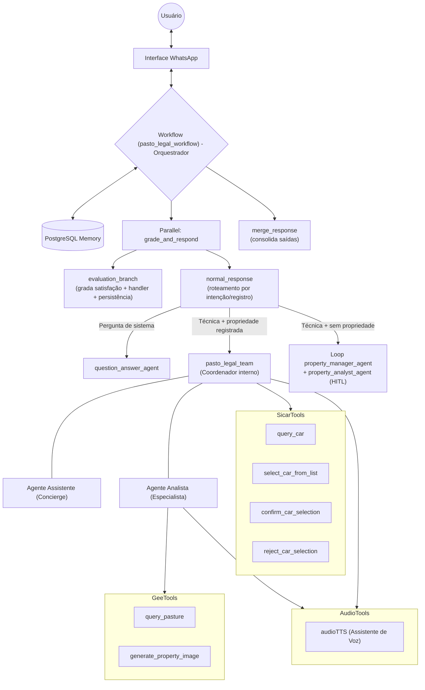
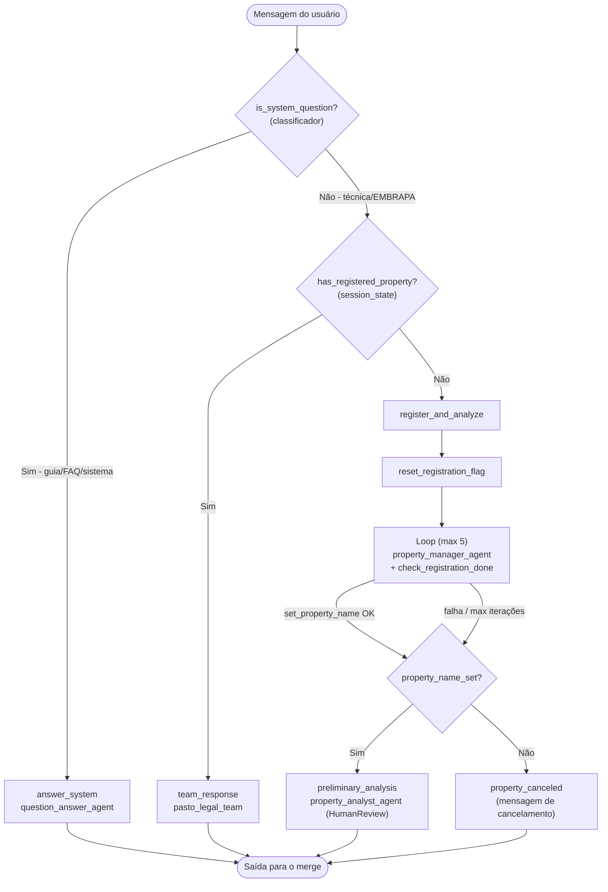
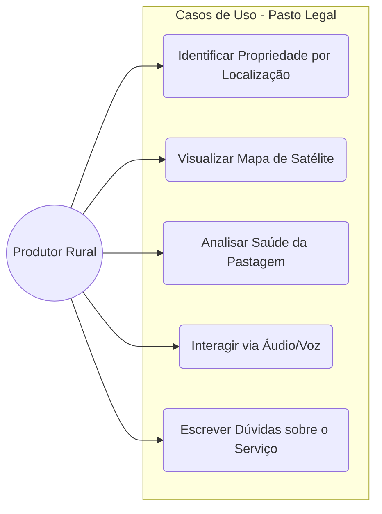
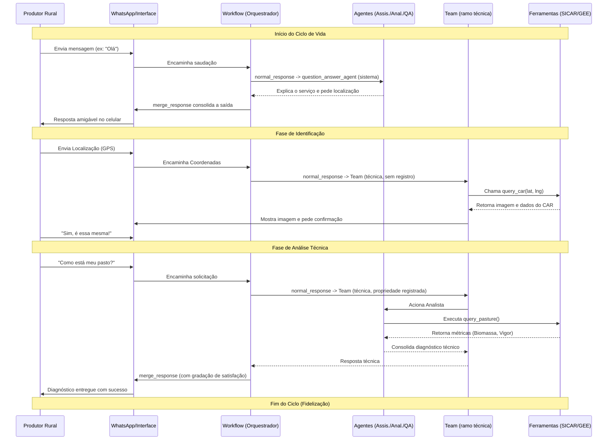

# Documentação Técnica: Workflow, Agentes, Time e Ferramentas

Esta página descreve a arquitetura do sistema Pasto Legal. O sistema é orquestrado por um **Workflow** (`pasto_legal_workflow`) construído sobre a biblioteca `Agno`. O Workflow é o ponto de execução principal — o **Time (Team)** deixou de ser o coordenador central e passou a ser uma das etapas internas do fluxo de resposta normal.

O Workflow avalia a satisfação do usuário e constrói uma mensagem de tratamento, **em paralelo** com a execução do agente normal, e então faz o merge das duas saídas. As interações frustradas/encantadas são persistidas no banco para fine-tuning futuro.

## Arquitetura do Sistema

O sistema utiliza a biblioteca `Agno` para orquestração. O **Workflow** (`pasto_legal_workflow`) é o coordenador central: ele roda duas vertentes em paralelo e consolida o resultado.


```mermaid
graph TD
    User((Usuário)) <--> WhatsApp[Interface WhatsApp]
    WhatsApp <--> WF{"Workflow (pasto_legal_workflow) - Orquestrador"}

    WF <--> DB[(PostgreSQL Memory)]

    WF --> Parallel["Parallel: grade_and_respond"]
    Parallel --> Eval["evaluation_branch<br/>(grada satisfação + handler + persistência)"]
    Parallel --> Normal["normal_response<br/>(roteamento por intenção/registro)"]
    WF --> Merge["merge_response<br/>(consolida saídas)"]

    Normal -->|Pergunta de sistema| QA["question_answer_agent"]
    Normal -->|Técnica + propriedade registrada| Team["pasto_legal_team<br/>(Coordenador interno)"]
    Normal -->|Técnica + sem propriedade| Reg["Loop property_manager_agent<br/>+ property_analyst_agent (HITL)"]

    Team --- Assistant["Agente Assistente (Concierge)"]
    Team --- Analyst["Agente Analista (Especialista)"]

    Team --> SicarTools["Ferramentas SICAR"]
    subgraph SicarTools
        query_car["query_car"]
        select_car["select_car_from_list"]
        confirm_car["confirm_car_selection"]
        reject_car["reject_car_selection"]
    end

    Team --> AudioTools["Ferramentas de Áudio"]
    subgraph AudioTools
        audioTTS["audioTTS (Assistente de Voz)"]
    end

    Analyst --> GeeTools["Ferramentas GEE (Google Earth Engine)"]
    subgraph GeeTools
        query_pasture["query_pasture"]
        generate_property_image["generate_property_image"]
    end

    Analyst --> AudioTools
```

---

## 1. O Workflow (Orquestrador)

O `pasto_legal_workflow` (`app/workflows/main_workflow.py`) é a composição raiz que monta o fluxo a partir de módulos menores em `app/workflows/`:

```python
pasto_legal_workflow = Workflow(
    name="Pasto Legal Workflow",
    db=db,
    steps=[
        Parallel(
            evaluation_branch,   # app.workflows.satisfaction
            normal_response,     # app.workflows.normal_response
            name="grade_and_respond",
        ),
        Step(name="merge_response", executor=merge_response),  # app.workflows.feedback
    ],
)
```

O fluxo de execução é:

1. **`grade_and_respond` (Parallel)** — roda duas vertentes simultaneamente:
    - **`evaluation_branch`**: grada a satisfação do usuário (1–5), ramifica em uma mensagem de tratamento (frustrado / neutro / encantado) e persiste a interação no banco (`FrustrationFeedback` para nota < 3, `PositiveFeedback` para nota > 3).
    - **`normal_response`**: produz a resposta técnica/normal conforme o estado do usuário (ver seção 2).
2. **`merge_response`** — consolida as duas vertentes. Se a nota foi < 3, antecede um pedido de desculpas e oferece "uma resposta melhor"; caso contrário, segue com a mensagem de tratamento + resposta normal.

> **Nota:** o `preliminary_analysis` dentro de `normal_response` usa revisão humana (HITL — `HumanReview`). A execução pausa (`is_paused=True`) e exige `workflow.continue_run()` + `req.confirm()` para prosseguir até o merge.

### Estrutura de arquivos do Workflow

O workflow foi dividido em módulos focados em `app/workflows/` (anteriormente um monolítico de ~450 linhas). Dependências sem ciclo:

| Módulo | Exporta | Responsabilidade |
|---|---|---|
| `main_workflow.py` | `pasto_legal_workflow` | Composição raiz — monta o fluxo final |
| `satisfaction.py` | `evaluation_branch` | Gradação de satisfação + ramificação 3-vias + handlers |
| `normal_response.py` | `normal_response` | Roteamento por intenção (sistema vs técnica) e estado de registro |
| `feedback.py` | `merge_response`, `save_frustration`, `save_amazed` | Persistência no banco + merge final |
| `phone_check.py` | `phone_number_check` | Helper de autorização por telefone (não conectado ainda) |

Grafo de dependência: `feedback ← satisfaction ← main`, `normal_response ← main`, `phone_check` isolado.

---

## 2. A vertente `normal_response` (roteamento)

A vertente de resposta normal é um `Condition` aninhado que roteia a mensagem do usuário:


```mermaid
graph TD
    Start([Mensagem do usuário]) --> C1{"is_system_question?<br/>(classificador)"}
    C1 -->|Sim - guia/FAQ/sistema| QA["answer_system<br/>question_answer_agent"]
    C1 -->|Não - técnica/EMBRAPA| C2{"has_registered_property?<br/>(session_state)"}
    C2 -->|Sim| Team["team_response<br/>pasto_legal_team"]
    C2 -->|Não| Reg["register_and_analyze"]
    Reg --> Reset["reset_registration_flag"]
    Reset --> Loop["Loop (max 5)<br/>property_manager_agent<br/>+ check_registration_done"]
    Loop -->|set_property_name OK| C3{"property_name_set?"}
    Loop -->|falha / max iterações| C3
    C3 -->|Sim| Hitl["preliminary_analysis<br/>property_analyst_agent (HumanReview)"]
    C3 -->|Não| Cancel["property_canceled<br/>(mensagem de cancelamento)"]
    QA --> End([Saída para o merge])
    Team --> End
    Hitl --> End
    Cancel --> End
```

- **Pergunta de sistema** (guias, FAQ, navegação) → `question_answer_agent`.
- **Pergunta técnica + propriedade registrada** → `pasto_legal_team` (o antigo coordenador, agora um passo interno).
- **Pergunta técnica sem propriedade** → um `Loop` de até 5 iterações com `property_manager_agent` até que `set_property_name` acione a flag `session_state["property_name_set"]`; então `property_analyst_agent` roda a análise preliminar (com revisão humana). Se a flag nunca for acionada, emite uma mensagem de **cancelamento de cadastro**.

---

## 3. O Time (Pasto Legal Team)

O **Pasto Legal Team** (`pasto_legal_team`) deixou de ser o orquestrador central e passou a ser uma etapa interna da vertente `normal_response`, acionada quando o usuário faz uma pergunta **técnica** e já tem uma **propriedade registrada**.

- **Modelo**: `gemini-2.5-flash`
- **Responsabilidade**:
    - Orquestrar a conversa entre o usuário e os membros da equipe (`Assistant` e `Analyst`) quando o assunto é técnico.
    - Gerenciar a memória da sessão via PostgreSQL.
    - Aplicar guardrails de segurança (ex: PII Detection).
    - Decidir qual ferramenta ou agente deve ser acionado para responder ao usuário.
- **Configurações Principais**:
    - `respond_directly=True`: Retorna a resposta do agente membro sem reinterpretação excessiva.
    - `enable_agentic_memory=True`: Mantém o contexto histórico da conversa.

## 4. Os Agentes (Members e do Workflow)

### 4.1 Agente Assistente (Assistant)
É o **Concierge** do serviço.
- **Papel**: Explica o que o sistema faz, recebe o usuário de forma amigável e esclarece dúvidas sobre as funcionalidades disponíveis.
- **Tom**: Simpático, coloquial e prestativo.
- **Foco**: Boas-vindas e guia de uso.

### 4.2 Agente Analista (Analyst)
É o **Especialista Técnico**.
- **Papel**: Executa análises espaciais complexas, gera métricas de pastagem e interpreta dados de satélite.
- **Ferramentas**: Utiliza `query_pasture` para métricas e `generate_property_image` para visualização.
- **Diretriz**: Baseia-se estritamente em ferramentas. Não inventa dados ("Alucinação Zero").

### 4.3 Agente SICAR (SICAR Agent)
É o Processador de Entradas Geográficas e Registros CAR.
- **Papel**: Responsável por conduzir interações relacionadas à localização, validação e seleção de propriedades rurais, utilizando o código CAR ou coordenadas geográficas como base.
- **Ferramentas**: Utiliza `query_feature_by_car` e `query_feature_by_coordinate` para buscas, além de `confirm_car_selection`, `select_car_from_list` e `reject_car_selection` para gerenciar a escolha do usuário.
- **Diretriz**: Atua estritamente na etapa em que o usuário se encontra (busca, seleção em lista ou confirmação). Ignora assuntos paralelos, redirecionando o usuário educadamente para a seleção do imóvel rural, e obedece rigidamente ao estado da sessão para acionar as ferramentas corretas.

### 4.4 Agentes do Workflow
Os agentes a seguir são específicos do fluxo do Workflow (definidos em `app/workflows/`):

- **Satisfaction Grader** (`satisfaction.py`): grada a satisfação do usuário em 1–5 (1 = frustrado, 3 = neutro, 5 = encantado), com saída estruturada (`SatisfactionGrade`).
- **Question Classifier** (`normal_response.py`): classifica a mensagem em sistema vs técnica (`QuestionType`), decidindo o roteamento inicial de `normal_response`.
- **Handlers de satisfação** (`satisfaction.py`): `frustration_handler_agent`, `neutral_handler_agent` e `amazed_handler_agent` — cada um redige uma mensagem curta e personalizada conforme o tom do usuário.
- **`question_answer_agent`**: responde perguntas sobre o sistema/guias/FAQ.
- **`property_manager_agent`**: conduz o cadastro da propriedade dentro do `Loop`.
- **`property_analyst_agent`**: roda a análise preliminar da propriedade (com revisão humana antes do merge).

---

## 5. Ferramentas (Tools)

### 5.1 SICAR Tools (`sicar_tools.py`)
Ferramentas para integração com o Cadastro Ambiental Rural (CAR).
- **`query_feature_by_coordinate`**: Localiza propriedades rurais a partir de coordenadas geográficas.
- **`query_feature_by_car`**: Localiza propriedades rurais a partir do registro CAR.
- **`confirm_car_selection` / `select_car_from_list` / `reject_car_selection`**: Gerenciam a seleção da propriedade correta pelo usuário.

### 5.2 GEE Tools (`gee_tools.py`)
Integração com Google Earth Engine para análise de dados geoespaciais.
- **`query_pasture`**: Retorna dados de biomassa, degradação e vigor da pastagem, idade da pastagem e uso e cobertura da terra.
- **`generate_property_image`**: Cria imagens de satélite com o contorno da propriedade.
- **`generate_property_biomass_image`**: Cria imagem de satélite com a distribuição de biomassa da propriedade.

### 5.3 Audio Tools (`audioTTS.py`)
Interface de comunicação por voz.
- **`audioTTS`**: Converte texto em fala com sotaque personalizado e transcreve áudios enviados pelos usuários.

### 5.4 Feedback Tools
Ferramentas para coleta de feedback do usuário.
- **`record_feedback`**: Registra o feedback de correção do usuário no banco de dados para melhorar a IA no futuro.

### 5.5 Property CRUD Tools (`property_crud_tools.py`)
Ferramentas de cadastro/edição de propriedades, acionadas dentro do `Loop` de registro do Workflow.
- **`set_property_name`**: Define o nome da propriedade selecionada e, **no caminho de sucesso**, aciona a flag `session_state["property_name_set"] = True` para que o `Loop` de registro saia.

---

## 6. Persistência de Feedback para Fine-tuning

O Workflow registra interações no banco para treinar/ajustar o modelo no futuro (executores em `app/workflows/feedback.py`):

- **`FrustrationFeedback`** (`save_frustration`): gravada quando a nota de satisfação é < 3. Guarda a pergunta original, a resposta dada, a mensagem de tratamento e o motivo (nota baixa), com mascaramento de PII.
- **`PositiveFeedback`** (`save_amazed`): gravada quando a nota é > 3. Guarda a mensagem do usuário, a resposta do assistente, a mensagem de tratamento, a nota e o contexto, para fine-tuning positivo.

> Ambos aplicam `_mask_pii` (de `app/tools/feedback_tools.py`) antes de persistir, para proteger dados sensíveis.

---

## 7. Casos de Uso

Os principais casos de uso descrevem como o produtor rural interage com o ecossistema de agentes para obter valor para sua atividade.


```mermaid
graph LR
    User((Produtor Rural))

    subgraph "Casos de Uso - Pasto Legal"
        UC1(Identificar Propriedade por Localização)
        UC2(Visualizar Mapa de Satélite)
        UC3(Analisar Saúde da Pastagem)
        UC4(Interagir via Áudio/Voz)
        UC5(Escrever Dúvidas sobre o Serviço)
    end

    User --> UC1
    User --> UC2
    User --> UC3
    User --> UC4
    User --> UC5
```

- **UC1**: O usuário envia uma localização (alfinete) no WhatsApp e o sistema identifica o CAR correspondente.
- **UC2**: Solicitação visual do limite da fazenda sobreposto a imagens recentes de satélite.
- **UC3**: Cálculo de índices de biomassa e identificação de áreas degradadas no pasto.
- **UC4**: Envio de áudios para comandos ou recebimento de relatórios técnicos narrados (TTS).
- **UC5**: Dúvidas sobre o serviço/guias — roteadas para `question_answer_agent`.

---

## 8. Ciclo de Vida do Usuário (Fluxo da Jornada)

Este diagrama detalha o percurso do usuário desde o primeiro contato até a entrega de um diagnóstico técnico, agora passando pelo Workflow.


```mermaid
sequenceDiagram
    participant U as Produtor Rural
    participant W as WhatsApp/Interface
    participant WF as Workflow (Orquestrador)
    participant A as Agentes (Assis./Anal./QA)
    participant T as Team (ramo técnica)
    participant F as Ferramentas (SICAR/GEE)

    Note over U, F: Início do Ciclo de Vida
    U->>W: Envia mensagem (ex: "Olá")
    W->>WF: Encaminha saudação
    WF->>A: normal_response -> question_answer_agent (sistema)
    A-->>WF: Explica o serviço e pede localização
    WF->>W: merge_response consolida a saída
    W->>U: Resposta amigável no celular

    Note over U, F: Fase de Identificação
    U->>W: Envia Localização (GPS)
    W->>WF: Encaminha Coordenadas
    WF->>T: normal_response -> Team (técnica, sem registro)
    T->>F: Chama query_car(lat, lng)
    F-->>T: Retorna imagem e dados do CAR
    T->>W: Mostra imagem e pede confirmação
    U->>W: "Sim, é essa mesma!"

    Note over U, F: Fase de Análise Técnica
    U->>W: "Como está meu pasto?"
    W->>WF: Encaminha solicitação
    WF->>T: normal_response -> Team (técnica, propriedade registrada)
    T->>A: Aciona Analista
    A->>F: Executa query_pasture()
    F-->>A: Retorna métricas (Biomassa, Vigor)
    A-->>T: Consolida diagnóstico técnico
    T-->>WF: Resposta técnica
    WF->>W: merge_response (com gradação de satisfação)
    W->>U: Diagnóstico entregue com sucesso

    Note over U, F: Fim do Ciclo (Fidelização)
```

---

## Fluxo de Trabalho Típico (Consolidado)

1. **Saudação**: O usuário inicia o contato e o **Workflow** roteia para `question_answer_agent` (pergunta de sistema), que explica as funcionalidades.
2. **Localização**: O usuário envia uma localização/GPS.
3. **Identificação**: Sem propriedade registrada, o Workflow entra no `Loop` com `property_manager_agent`, que aciona o `query_car` para encontrar o imóvel rural no site do SICAR.
4. **Confirmação**: O usuário valida se a imagem de satélite corresponde à sua propriedade; `set_property_name` aciona a flag e o `Loop` sai.
5. **Análise preliminar**: O `property_analyst_agent` roda a análise preliminar, com **revisão humana (HITL)** antes de seguir.
6. **Análise técnica**: Com a propriedade registrada, o Workflow roteia para o **Team**, que delega ao **Analista** (`query_pasture` ou `generate_property_image`).
7. **Entrega**: Paralelamente, a **gradação de satisfação** produziu uma mensagem de tratamento; o **merge** consolida tudo e envia ao usuário via WhatsApp. Interações frustradas/encantadas são persistidas para fine-tuning futuro.