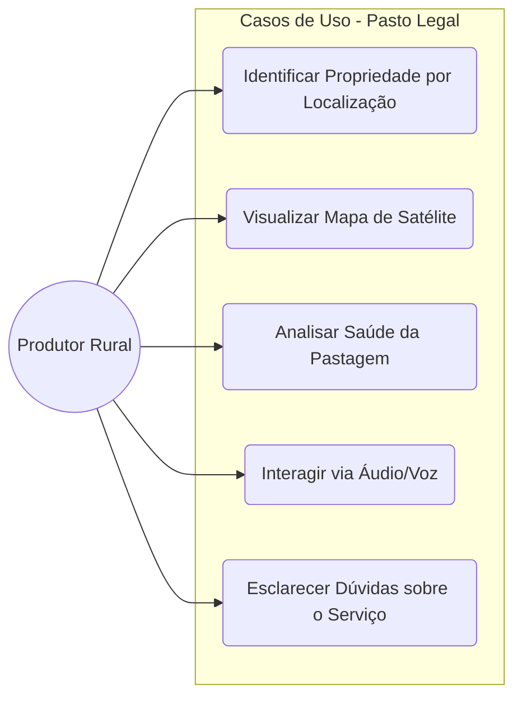

# Documentação Técnica: Agentes, Time e Ferramentas

Esta página descreve a arquitetura do sistema Pasto Legal, detalhando como os agentes colaboram em equipe para fornecer suporte ao produtor rural utilizando diversas ferramentas técnicas.

## Arquitetura do Sistema

O sistema utiliza a biblioteca `Agno` para orquestração de múltiplos agentes. O fluxo de interação segue uma hierarquia onde o **Time (Team)** coordena a comunicação e delega tarefas aos agentes especializados.

---

## 1. O Time (Pasto Legal Team)

O **Pasto Legal Team** (`pasto_legal_team`) atua como o cérebro central e coordenador.

- **Modelo**: `gemini-2.5-flash`
- **Responsabilidade**: 
    - Orquestrar a conversa entre o usuário e os membros da equipe (`Assistant` e `Analyst`).
    - Gerenciar a memória da sessão via PostgreSQL.
    - Aplicar guardrails de segurança (ex: PII Detection).
    - Decidir qual ferramenta ou agente deve ser acionado para responder ao usuário.
- **Configurações Principais**:
    - `respond_directly=True`: Retorna a resposta do agente membro sem reinterpretação excessiva.
    - `enable_agentic_memory=True`: Mantém o contexto histórico da conversa.

## 2. Os Agentes (Members)

### 2.1 Agente Assistente (Assistant)
É o **Concierge** do serviço.
- **Papel**: Explica o que o sistema faz, recebe o usuário de forma amigável e esclarece dúvidas sobre as funcionalidades disponíveis.
- **Tom**: Simpático, coloquial e prestativo.
- **Foco**: Boas-vindas e guia de uso.

### 2.2 Agente Analista (Analyst)
É o **Especialista Técnico**.
- **Papel**: Executa análises espaciais complexas, gera métricas de pastagem e interpreta dados de satélite.
- **Ferramentas**: Utiliza `query_pasture` para métricas e `generate_property_image` para visualização.
- **Diretriz**: Baseia-se estritamente em ferramentas. Não inventa dados ("Alucinação Zero").

### 2.3 Agente SICAR (SICAR Agent)
É o Processador de Entradas Geográficas e Registros CAR.
- **Papel**: Responsável por conduzir interações relacionadas à localização, validação e seleção de propriedades rurais, utilizando o código CAR ou coordenadas geográficas como base.
- **Ferramentas**: Utiliza `query_feature_by_car` e `query_feature_by_coordinate` para buscas, além de `confirm_car_selection`, `select_car_from_list` e `reject_car_selection` para gerenciar a escolha do usuário.
- **Diretriz**: Atua estritamente na etapa em que o usuário se encontra (busca, seleção em lista ou confirmação). Ignora assuntos paralelos, redirecionando o usuário educadamente para a seleção do imóvel rural, e obedece rigidamente ao estado da sessão para acionar as ferramentas corretas.

---

## 3. Ferramentas (Tools)

### 3.1 SICAR Tools (`sicar_tools.py`)
Ferramentas para integração com o Cadastro Ambiental Rural (CAR).
- **`query_feature_by_coordinate`**: Localiza propriedades rurais a partir de coordenadas geográficas.
- **`query_feature_by_car`**: Localiza propriedades rurais a partir do registro CAR.
- **`confirm_car_selection` / `select_car_from_list` / `reject_car_selection`**: Gerenciam a seleção da propriedade correta pelo usuário.

### 3.2 GEE Tools (`gee_tools.py`)
Integração com Google Earth Engine para análise de dados geoespaciais.
- **`query_pasture`**: Retorna dados de biomassa, degradação e vigor da pastagem, idade da pastagem e uso e cobertura da terra.
- **`generate_property_image`**: Cria imagens de satélite com o contorno da propriedade.
- **`generate_property_biomass_image`**: Cria imagem de satélite com a distribuição de biomassa da propriedade.

### 3.3 Audio Tools (`audioTTS.py`)
Interface de comunicação por voz.
- **`audioTTS`**: Converte texto em fala com sotaque personalizado e transcreve áudios enviados pelos usuários.

### 3.4 Feedback Tools
Ferramentas para coleta de feedback do usuário.
- **`record_feedback`**: Registra o feedback de correção do usuário no banco de dados para melhorar a IA no futuro.

---

---

## 4. Casos de Uso

Os principais casos de uso descrevem como o produtor rural interage com o ecossistema de agentes para obter valor para sua atividade.

- **UC1**: O usuário envia uma localização (alfinete) no WhatsApp e o sistema identifica o CAR correspondente.
- **UC2**: Solicitação visual do limite da fazenda sobreposto a imagens recentes de satélite.
- **UC3**: Cálculo de índices de biomassa e identificação de áreas degradadas no pasto.
- **UC4**: Envio de áudios para comandos ou recebimento de relatórios técnicos narrados (TTS).

---

## 5. Ciclo de Vida do Usuário (Fluxo da Jornada)

Este diagrama detalha o percurso do usuário desde o primeiro contato até a entrega de um diagnóstico técnico.

---

## Fluxo de Trabalho Típico (Consolidado)

1. **Saudação**: O usuário inicia o contato e o **Assistente** explica as funcionalidades.
2. **Localização**: O usuário envia uma localização/GPS.
3. **Identificação**: O **Time** aciona o `query_car` para encontrar o imóvel rural no site do SICAR.
4. **Confirmação**: O usuário valida se a imagem de satélite corresponde à sua propriedade.
5. **Análise**: O usuário solicita a qualidade do pasto ou uma imagem da área.
6. **Execução**: O **Time** delega para o **Analista**, que roda o `query_pasture` ou `generate_property_image`.
7. **Entrega**: O **Analista** interpreta os dados técnicos e o **Time** consolida a resposta final enviando ao usuário via WhatsApp.
