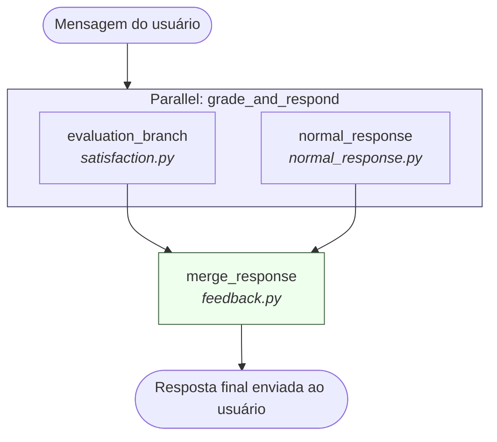
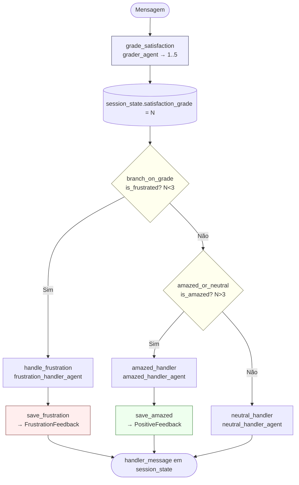
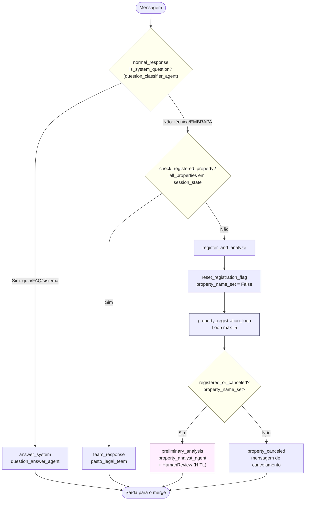
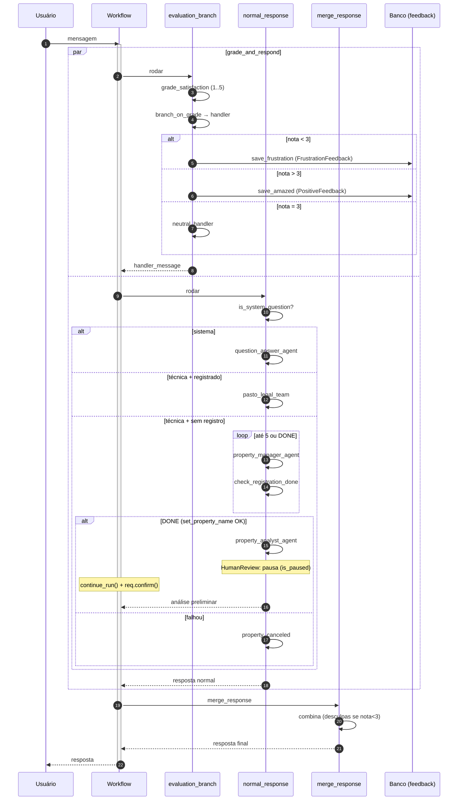
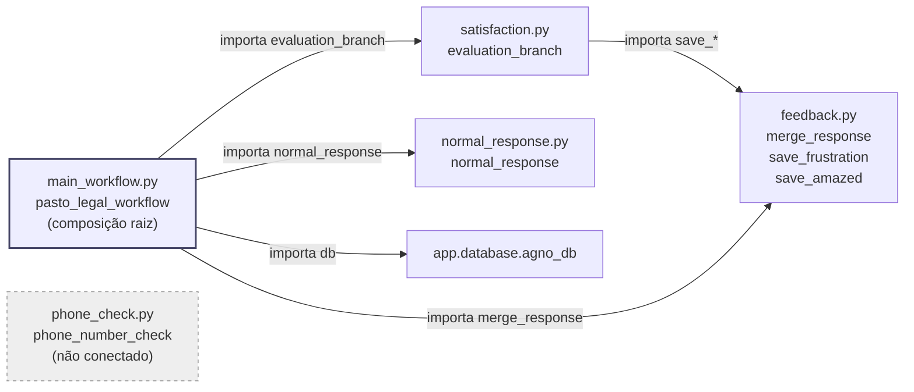
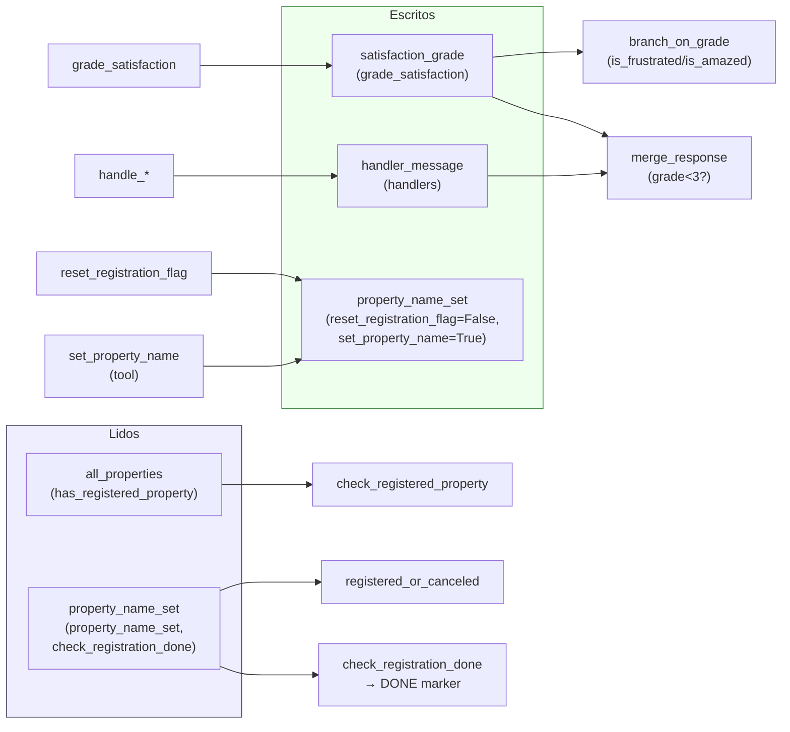

# Diagramas da Arquitetura do Workflow

Coleção de diagramas (Mermaid) para visualizar a arquitetura do `pasto_legal_workflow`. Cada diagrama foca em uma perspectiva diferente.

> Os diagramas Mermaid podem ser renderizados no GitHub/GitLab diretamente, ou colados em https://mermaid.live.

---

## 1. Visão Geral — Orquestração de Alto Nível

O Workflow roda duas vertentes em paralelo (`grade_and_respond`) e então consolida tudo no `merge_response`.



---

## 2. Detalhe — `evaluation_branch` (gradação de satisfação)

Grada a satisfação (1–5), ramifica em 3 vias (Condition é binária, então a 3ª via é um Condition aninhado) e persiste feedback.



---

## 3. Detalhe — `normal_response` (roteamento por intenção/registro)

Roteia a mensagem: pergunta de sistema → Q&A; técnica com propriedade → Team; técnica sem propriedade → Loop de cadastro + análise preliminar.



---

## 4. Detalhe — `property_registration_loop` (o Loop de cadastro)

O `Loop` roda `property_manager_agent` + `check_registration_done` por até 5 iterações, encadeando a saída de uma iteração na próxima (`forward_iteration_output=True`).

```mermaid
flowchart TD
    Start([Início do Loop]) --> Iter["Iteração i (1..5)"]
    Iter --> PM["property_manager<br/>property_manager_agent"]
    PM --> CD{"check_registration_done<br/>property_name_set?"}
    CD -->|Não| Fwd["Encaminha conteúdo do agente<br/>→ próxima iteração"]
    Fwd -->|próxima iteração| Iter
    CD -->|Sim| Done['Retorna "DONE"']
    Done --> Exit([Sai do Loop])

    Iter -. max 5 atingido .-> MaxExit["Saída por limite<br/>sem DONE"]
    MaxExit --> Exit

    style CD fill:#ffe,stroke:#886
    style Done fill:#efe,stroke:#484
    style MaxExit fill:#fee,stroke:#844
```

---

## 5. Sequência — Execução de ponta a ponta (com paralelismo e HITL)

Mostra como as duas vertentes rodam em paralelo e onde o HITL pausa a execução antes do merge.



---

## 6. Módulos — Grafo de Dependências

Como o monolito foi dividido em `app/workflows/`. Sem ciclos.



---

## 7. Fluxo de `session_state`

Quais chaves o Workflow lê/escreve no `session_state` compartilhado. Esse dicionário é a cola entre as vertentes paralelas e o merge.



> **Observação sobre o `Loop`:** o `end_condition` recebe apenas `List[StepOutput]` (sem acesso a `session_state`). Por isso `check_registration_done` expõe a flag como o marcador `"DONE"` em um `StepOutput`, e `_registration_end_condition` procura por `"DONE"`. Com `forward_iteration_output=True`, quando ainda não terminou, o passo repassa o conteúdo anterior do agente para a próxima iteração manter a conversa.

---

## 8. Mapa de Saídas do `merge_response`

Como o resultado final é montado conforme a nota de satisfação.

```mermaid
flowchart TD
    Merge["merge_response"]
    Merge --> G{"grade < 3?"}
    G -->|Sim: frustrado| Frustrado["\"Desculpe pelo inconveniente. {handler}\n\nAqui está uma resposta melhor:\n{normal_response}\""]
    G -->|Não: neutro ou encantado| NeutroOk["{handler}\n\n{normal_response}"]
    NeutroOk --> SemHandler{"handler vazio?"}
    SemHandler -->|Sim| ApenasNormal["{normal_response}"]
    SemHandler -->|Não| ComHandler["{handler}\n\n{normal_response}"]

    Frustrado --> Out([Resposta final])
    ApenasNormal --> Out
    ComHandler --> Out

    style Frustrado fill:#fee,stroke:#844
    style ComHandler fill:#efe,stroke:#484
    style ApenasNormal fill:#efe,stroke:#484
```