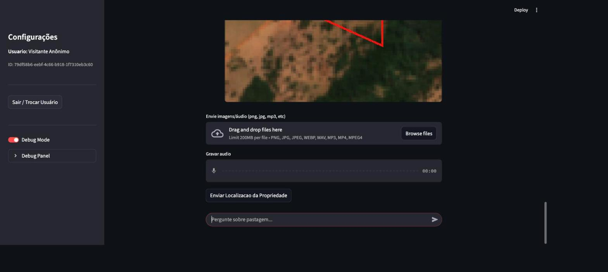
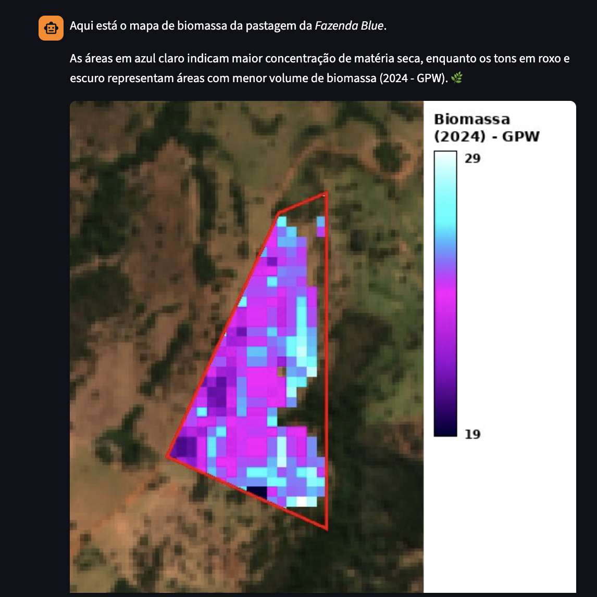
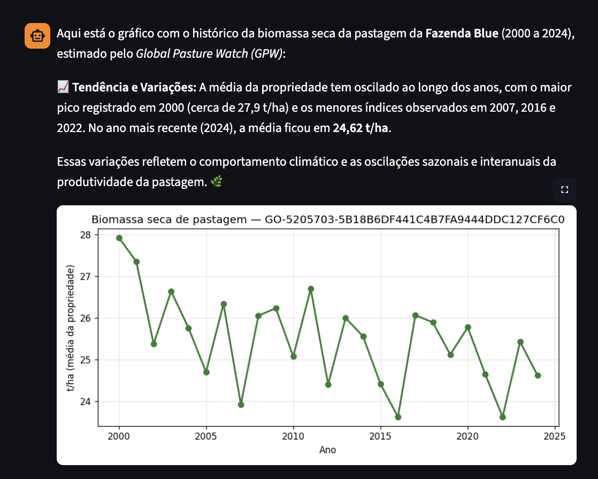
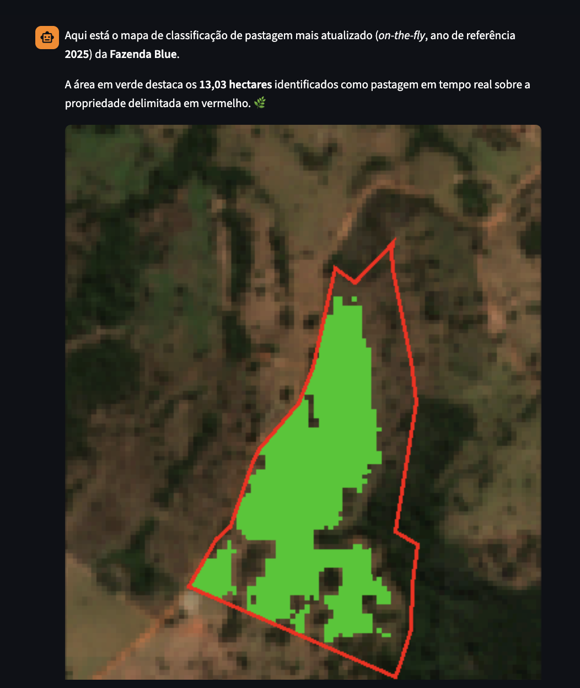
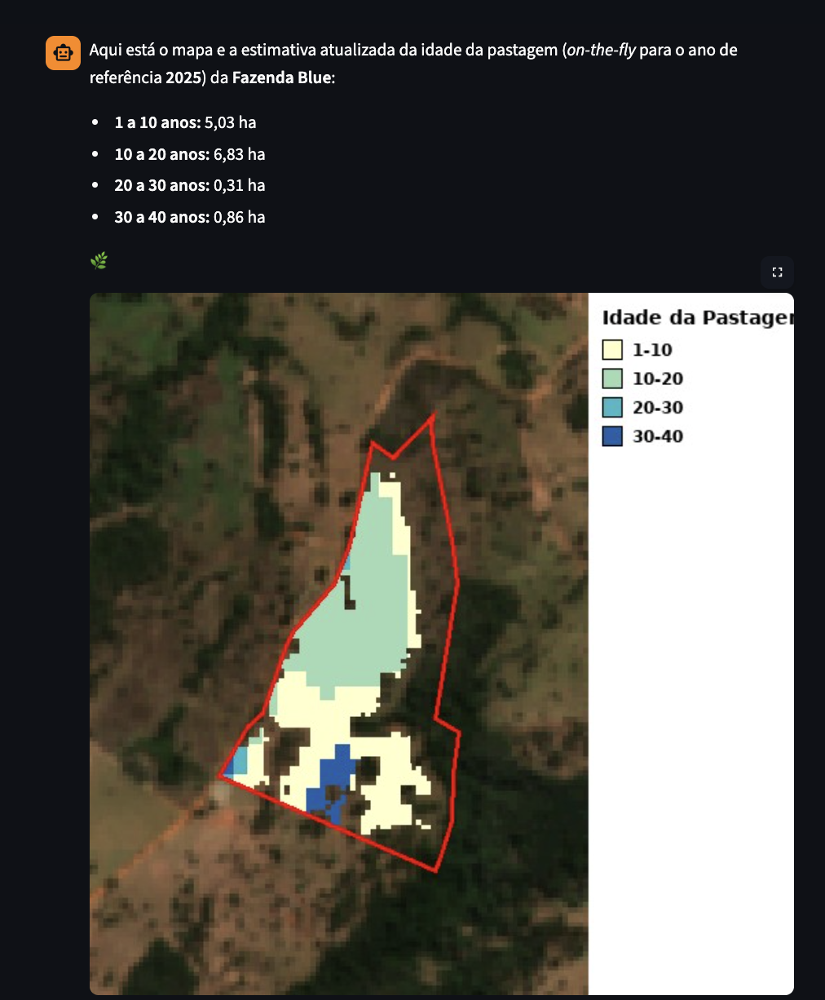
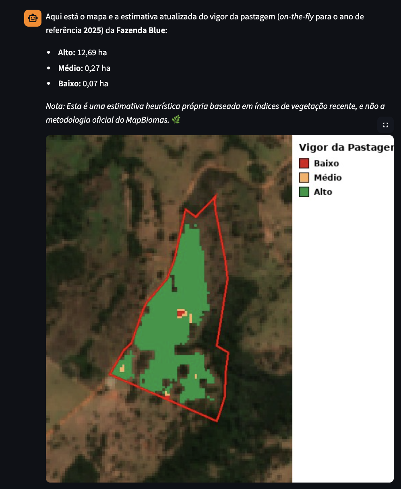
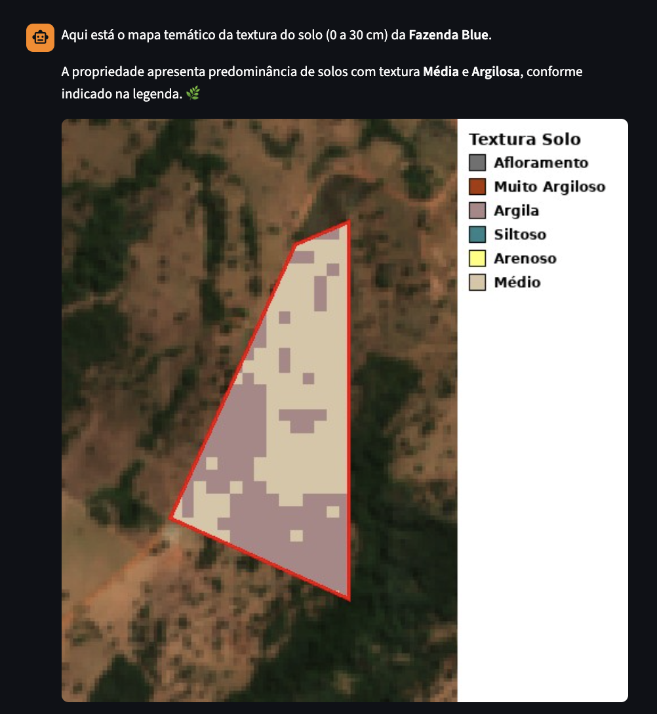
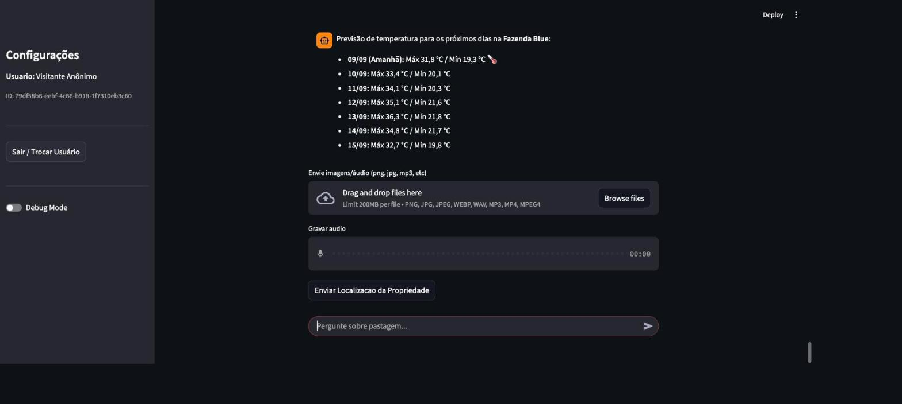
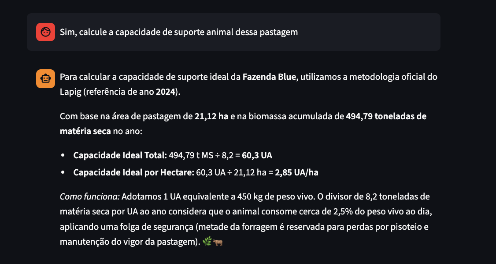

# Teste ponta a ponta — Pasto Legal (2026-09-09)

Teste completo da aplicação rodando ao vivo (Docker/Colima, `http://localhost:8080`), cobrindo o fluxo de cadastro do zero e **todas** as tools do agente — as que já existiam e as que implementamos (idade e vigor de pastagem on-the-fly). Propriedade de teste: **GO-5205703-5B18B6DF441C4B7FA9444DDC127CF6C0** ("Fazenda Blue", Córrego do Ouro-GO, 23,47 ha), usuário anônimo, sessão nova.

**Resultado: 16/16 tools testadas responderam corretamente com dado real do GEE/APIs, imagem/gráfico renderizado quando aplicável, e nenhum erro/exceção na interface.**

---

## 1. Onboarding — login, termos, cadastro por CAR, apelido


Fluxo completo: login anônimo → aceite dos Termos de Uso → busca da propriedade pelo código CAR (SICAR) → confirmação da área (23,47 ha) → apelido ("Fazenda Blue"). Tudo funcionando sem erros.

---

## 2. Imagem de satélite da propriedade — `generate_property_image`



Imagem RGB real do satélite com o contorno da propriedade (CAR) desenhado em vermelho.

---

## 3. Mapa de biomassa (ano atual) — `generate_biomass_image`



Mapa de biomassa 2024 (fallback GPW, já que o T2G não cobre esta propriedade) com paleta contínua e barra de legenda.

---

## 4. Histórico de biomassa (2000–2024) — `get_pasture_biomass_history`



Gráfico de tendência gerado dinamicamente (matplotlib) com a série completa 2000–2024. Pico em 2000 (~27,9 t/ha), 2024 em 24,62 t/ha — resposta do agente bateu exatamente com o eixo do gráfico.

---

## 5. Classificação de pastagem on-the-fly (uso/cobertura) — `generate_pasture_classification_image`



13,03 ha de pastagem identificados para 2025 (RandomForest treinado com MapBiomas 2024 + Satellite Embedding, predição sobre o embedding de 2025). Esse número bate exatamente com a soma das 4 faixas de idade do teste seguinte (5,03+6,83+0,31+0,86 = 13,03 ha) — confirma que idade e classificação estão usando a mesma máscara de pastagem.

---

## 6. Idade da pastagem on-the-fly (NOVO) — `get_pasture_age_on_the_fly`



```
1 a 10 anos: 5,03 ha
10 a 20 anos: 6,83 ha
20 a 30 anos: 0,31 ha
30 a 40 anos: 0,86 ha
```

Mapa com 4 cores distintas proporcionais à área de cada faixa (cache do dia anterior — mesmo bug de renderização já corrigido permanece corrigido). Números idênticos ao teste automatizado (`test_pasture_age.py`).

---

## 7. Vigor da pastagem on-the-fly (NOVO) — `get_pasture_vigor_on_the_fly`



```
Alto: 12,69 ha
Médio: 0,27 ha
Baixo: 0,07 ha
```

Nota de transparência exibida corretamente no chat: *"Esta é uma estimativa heurística própria baseada em índices de vegetação recente, e não a metodologia oficial do MapBiomas."* Calibração caiu em modo *fallback* para esta propriedade pequena (esperado — ver relatório da issue #112).

---

## 8. Textura do solo — `generate_soil_texture_image`



Mapa temático (0–30 cm), predominância de solo Médio/Argiloso identificada corretamente.

---

## 9. Estatísticas topográficas — `get_topographic_stats`


Altitude média 708,22 m, declividade média 10,35°.

---

## 10. Diagnóstico completo (estático, MapBiomas 2024) — `get_pasture_stats`


Biomassa (494,79 t total), LULC, vigor e idade — todos no ano de referência 2024 (dado oficial mais recente do MapBiomas). **Divergência esperada e correta** frente aos números on-the-fly acima: 21,12 ha (2024, estático) vs. 13,03 ha (2025, on-the-fly) — anos e metodologias diferentes, não é bug (é exatamente o problema de defasagem que a issue #112 resolve).

---

## 11. Previsão de chuva — mensal, diária, início das estações — `get_monthly_precipitation_forecast` / `get_daily_precipitation_forecast` / `get_rain_season_onset_forecast` / `get_dry_season_onset_forecast`


Mensal e diária retornaram números concretos (54,4 mm em setembro; 0,3–1,2 mm amanhã). As duas tools de **início de estação** responderam com uma explicação honesta de que o horizonte de previsão atual não cobre uma data exata, e ofereceram a tendência sazonal em vez disso — comportamento de degradação graciosa, não um erro/crash. Vale ficar de olho se esse é o comportamento pretendido ou se a fonte de dados de sazonalidade deveria cobrir mais meses à frente.

---

## 12. Previsão de temperatura — `get_temperature_forecast`



Tabela de 7 dias com máxima/mínima.

---

## 13. Boletim em PDF — `generate_property_boletim` (ainda em desenvolvimento)


PDF gerado com sucesso (mapas de localização, pastagem, vigor, biomassa e solo), botão de download funcional, resumo no chat consistente com o diagnóstico estático (494,79 t / 21,12 ha) e aviso automático sobre a defasagem do LULC/vigor/idade (2024) vs. biomassa (mês/ano atual).

---

## 14. Capacidade de suporte animal (cálculo via LLM + CalculatorTools)



Não é uma tool dedicada — o agente usa `CalculatorTools` para compor o cálculo (494,79 t MS ÷ 8,2 t/UA/ano = 60,3 UA; ÷ 21,12 ha = 2,85 UA/ha) a partir dos dados já coletados na conversa, com a fórmula explicada. Funcionou corretamente.

---

## Resumo

| # | Feature | Tool | Status |
|---|---|---|---|
| 1 | Onboarding completo | property_tools (registro) | ✅ |
| 2 | Imagem de satélite | `generate_property_image` | ✅ |
| 3 | Mapa de biomassa | `generate_biomass_image` | ✅ |
| 4 | Histórico de biomassa | `get_pasture_biomass_history` | ✅ |
| 5 | Classificação on-the-fly | `generate_pasture_classification_image` | ✅ |
| 6 | **Idade on-the-fly (novo)** | `get_pasture_age_on_the_fly` | ✅ |
| 7 | **Vigor on-the-fly (novo)** | `get_pasture_vigor_on_the_fly` | ✅ |
| 8 | Textura do solo | `generate_soil_texture_image` | ✅ |
| 9 | Estatísticas topográficas | `get_topographic_stats` | ✅ |
| 10 | Diagnóstico estático | `get_pasture_stats` | ✅ |
| 11 | Chuva mensal | `get_monthly_precipitation_forecast` | ✅ |
| 12 | Chuva diária | `get_daily_precipitation_forecast` | ✅ |
| 13 | Início da chuva | `get_rain_season_onset_forecast` | ⚠️ sem data exata (esperado) |
| 14 | Início da seca | `get_dry_season_onset_forecast` | ⚠️ sem data exata (esperado) |
| 15 | Temperatura | `get_temperature_forecast` | ✅ |
| 16 | Boletim PDF | `generate_property_boletim` | ✅ |
| — | Capacidade de suporte (UA) | `CalculatorTools` (via LLM) | ✅ |

Nenhum erro, exceção ou resposta quebrada apareceu na UI durante todo o teste. 
