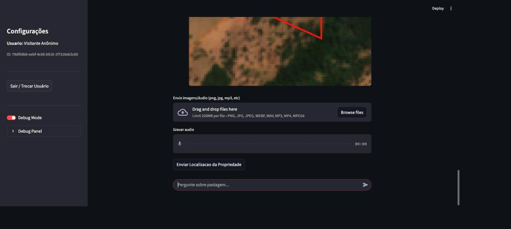
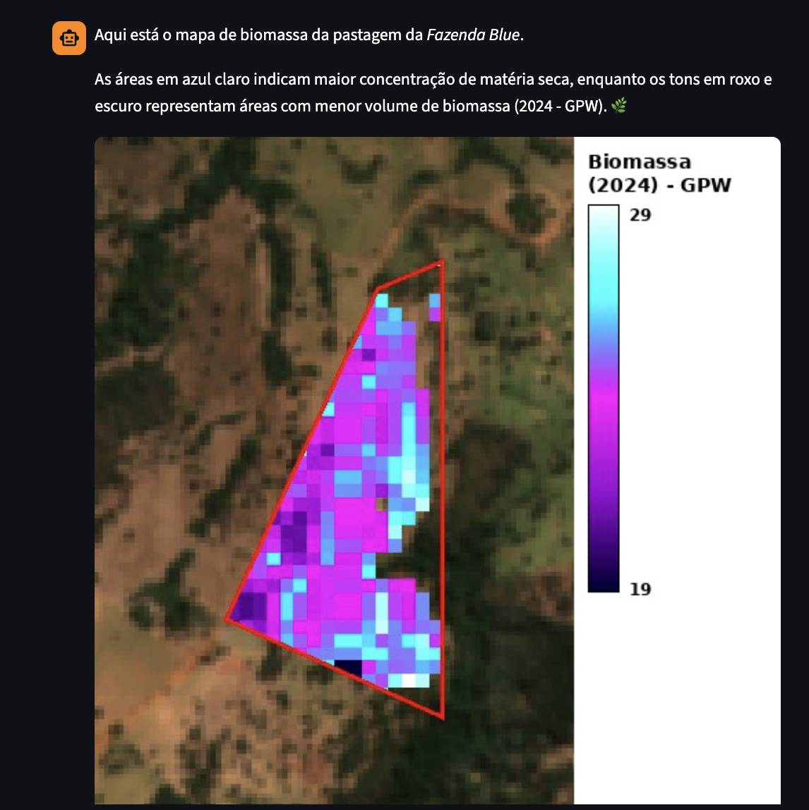
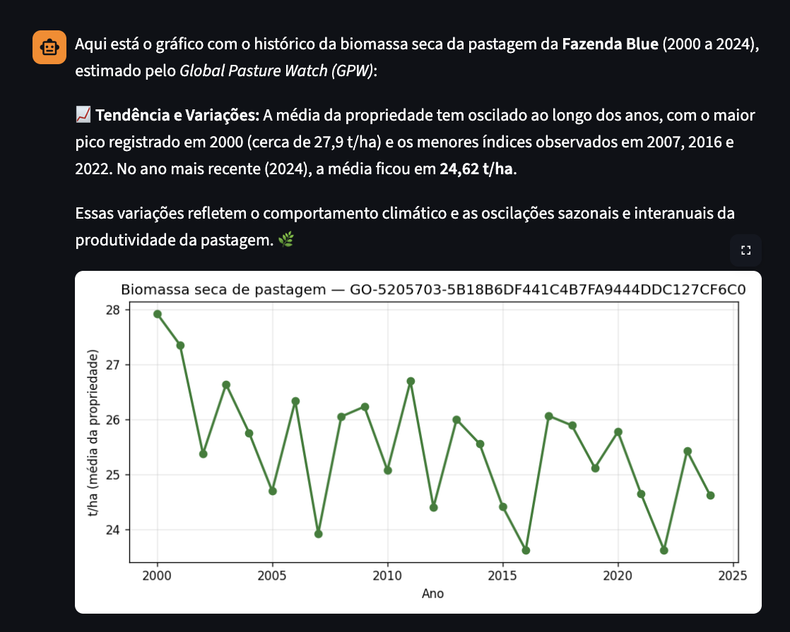
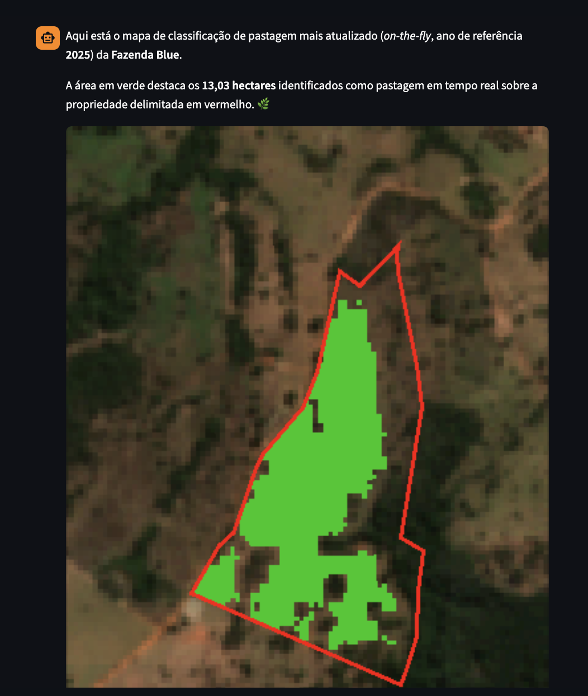
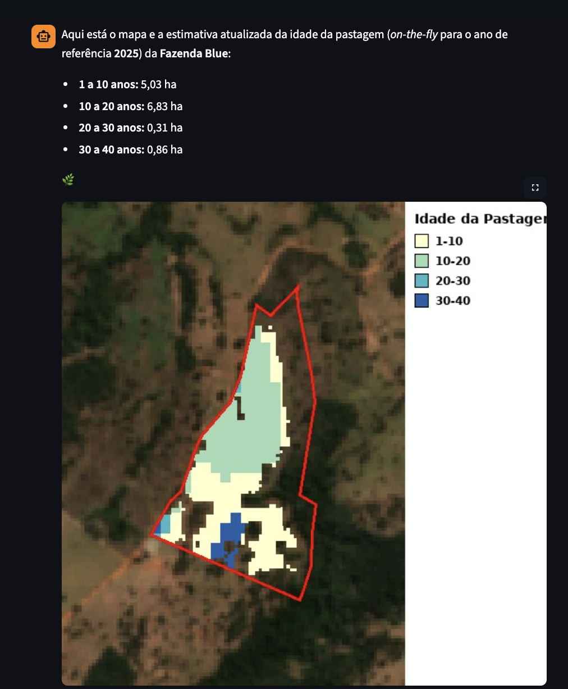
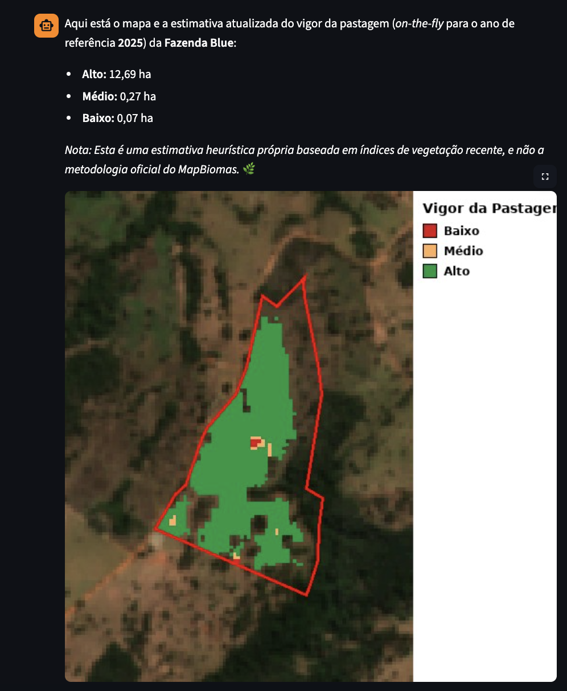
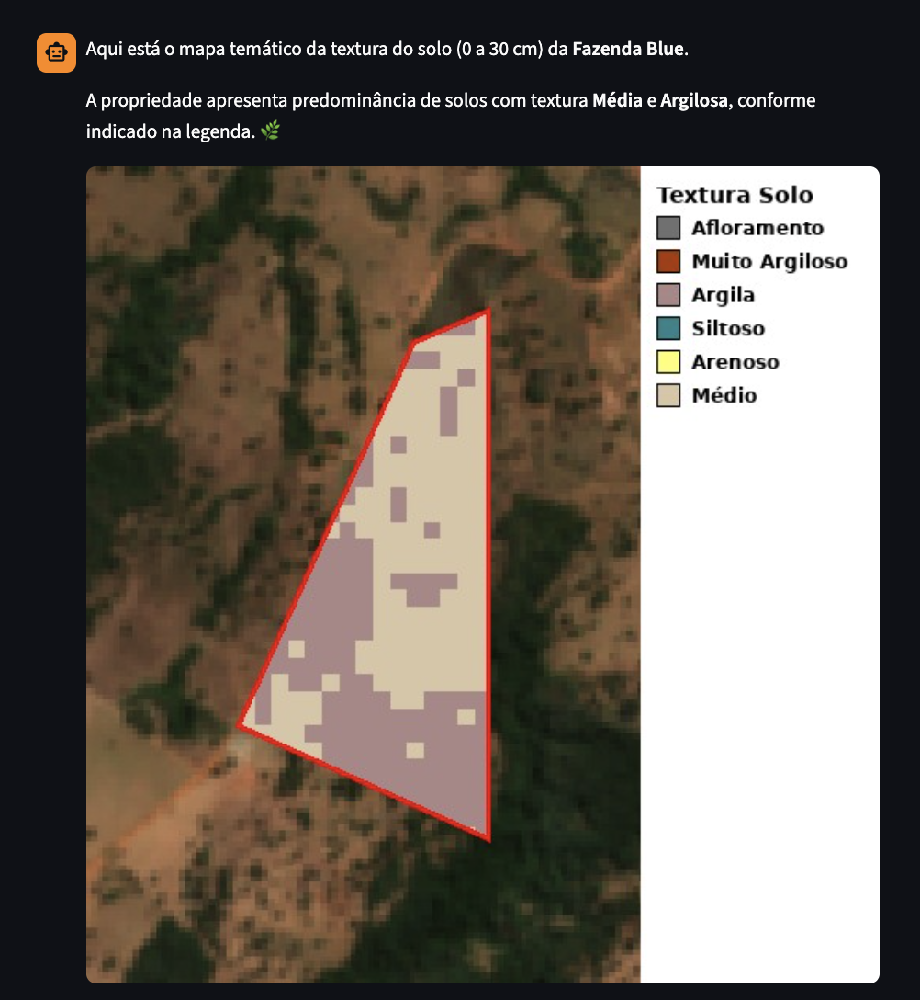
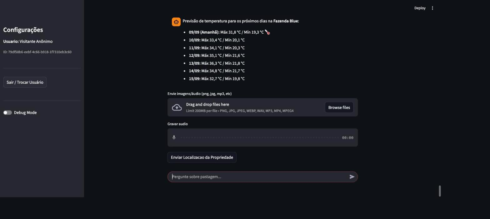
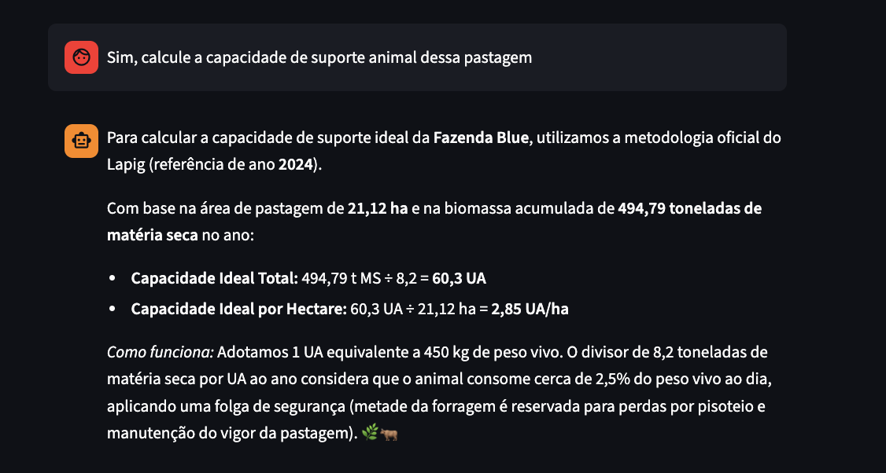
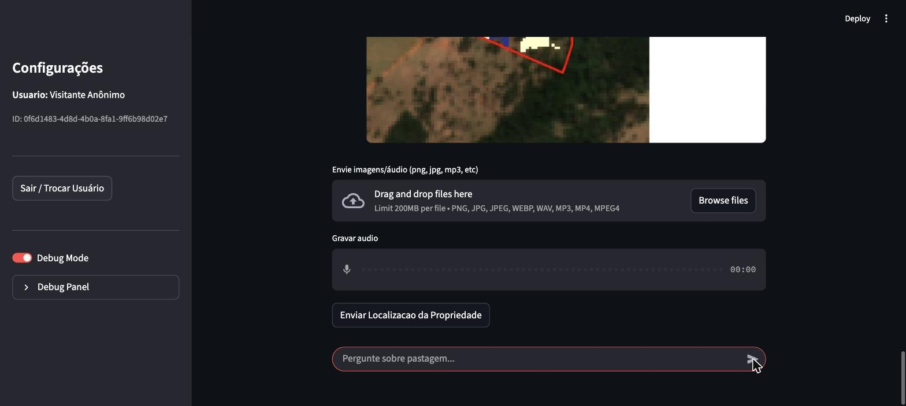

# Teste ponta a ponta — Pasto Legal (2026-09-09)

> **Atualização (mesmo dia, retest pós-auditoria):** uma auditoria externa apontou 9 problemas reais no
> pipeline (idade/vigor/biomassa/cache). Corrigi 8 deles e revalidei tudo — real GEE (pytest) + chat ao
> vivo de novo. Detalhes na seção **"Retest pós-auditoria"** no final deste documento.

Teste completo da aplicação rodando ao vivo (Docker/Colima, `http://localhost:8080`), cobrindo o fluxo de cadastro do zero e **todas** as tools do agente — as que já existiam e as que implementamos (idade e vigor de pastagem on-the-fly). Propriedade de teste: **GO-5205703-5B18B6DF441C4B7FA9444DDC127CF6C0** ("Fazenda Blue", Córrego do Ouro-GO, 23,47 ha), usuário anônimo, sessão nova.

**Resultado: 16/16 tools testadas responderam corretamente com dado real do GEE/APIs, imagem/gráfico renderizado quando aplicável, e nenhum erro/exceção na interface.**

---

## 1. Onboarding — login, termos, cadastro por CAR, apelido


Fluxo completo: login anônimo → aceite dos Termos de Uso → busca da propriedade pelo código CAR (SICAR) → confirmação da área (23,47 ha) → apelido ("Fazenda Blue"). Tudo funcionando sem erros.

---

## 2. Imagem de satélite da propriedade — `generate_property_image`



Imagem RGB real do satélite com o contorno da propriedade (CAR) desenhado em vermelho.

---

## 3. Mapa de biomassa (ano atual) — `generate_biomass_image`



Mapa de biomassa 2024 (fallback GPW, já que o T2G não cobre esta propriedade) com paleta contínua e barra de legenda.

---

## 4. Histórico de biomassa (2000–2024) — `get_pasture_biomass_history`



Gráfico de tendência gerado dinamicamente (matplotlib) com a série completa 2000–2024. Pico em 2000 (~27,9 t/ha), 2024 em 24,62 t/ha — resposta do agente bateu exatamente com o eixo do gráfico.

---

## 5. Classificação de pastagem on-the-fly (uso/cobertura) — `generate_pasture_classification_image`



13,03 ha de pastagem identificados para 2025 (RandomForest treinado com MapBiomas 2024 + Satellite Embedding, predição sobre o embedding de 2025). Esse número bate exatamente com a soma das 4 faixas de idade do teste seguinte (5,03+6,83+0,31+0,86 = 13,03 ha) — confirma que idade e classificação estão usando a mesma máscara de pastagem.

---

## 6. Idade da pastagem on-the-fly (NOVO) — `get_pasture_age_on_the_fly`



```
1 a 10 anos: 5,03 ha
10 a 20 anos: 6,83 ha
20 a 30 anos: 0,31 ha
30 a 40 anos: 0,86 ha
```

Mapa com 4 cores distintas proporcionais à área de cada faixa (cache do dia anterior — mesmo bug de renderização já corrigido permanece corrigido). Números idênticos ao teste automatizado (`test_pasture_age.py`).

---

## 7. Vigor da pastagem on-the-fly (NOVO) — `get_pasture_vigor_on_the_fly`



```
Alto: 12,69 ha
Médio: 0,27 ha
Baixo: 0,07 ha
```

Nota de transparência exibida corretamente no chat: *"Esta é uma estimativa heurística própria baseada em índices de vegetação recente, e não a metodologia oficial do MapBiomas."* Calibração caiu em modo *fallback* para esta propriedade pequena (esperado — ver relatório da issue #112).

---

## 8. Textura do solo — `generate_soil_texture_image`



Mapa temático (0–30 cm), predominância de solo Médio/Argiloso identificada corretamente.

---

## 9. Estatísticas topográficas — `get_topographic_stats`


Altitude média 708,22 m, declividade média 10,35°.

---

## 10. Diagnóstico completo (estático, MapBiomas 2024) — `get_pasture_stats`


Biomassa (494,79 t total), LULC, vigor e idade — todos no ano de referência 2024 (dado oficial mais recente do MapBiomas). **Divergência esperada e correta** frente aos números on-the-fly acima: 21,12 ha (2024, estático) vs. 13,03 ha (2025, on-the-fly) — anos e metodologias diferentes, não é bug (é exatamente o problema de defasagem que a issue #112 resolve).

---

## 11. Previsão de chuva — mensal, diária, início das estações — `get_monthly_precipitation_forecast` / `get_daily_precipitation_forecast` / `get_rain_season_onset_forecast` / `get_dry_season_onset_forecast`


Mensal e diária retornaram números concretos (54,4 mm em setembro; 0,3–1,2 mm amanhã). As duas tools de **início de estação** responderam com uma explicação honesta de que o horizonte de previsão atual não cobre uma data exata, e ofereceram a tendência sazonal em vez disso — comportamento de degradação graciosa, não um erro/crash. Vale ficar de olho se esse é o comportamento pretendido ou se a fonte de dados de sazonalidade deveria cobrir mais meses à frente.

---

## 12. Previsão de temperatura — `get_temperature_forecast`



Tabela de 7 dias com máxima/mínima.

---

## 13. Boletim em PDF — `generate_property_boletim` (ainda em desenvolvimento)


PDF gerado com sucesso (mapas de localização, pastagem, vigor, biomassa e solo), botão de download funcional, resumo no chat consistente com o diagnóstico estático (494,79 t / 21,12 ha) e aviso automático sobre a defasagem do LULC/vigor/idade (2024) vs. biomassa (mês/ano atual).

---

## 14. Capacidade de suporte animal (cálculo via LLM + CalculatorTools)



Não é uma tool dedicada — o agente usa `CalculatorTools` para compor o cálculo (494,79 t MS ÷ 8,2 t/UA/ano = 60,3 UA; ÷ 21,12 ha = 2,85 UA/ha) a partir dos dados já coletados na conversa, com a fórmula explicada. Funcionou corretamente.

---

## Resumo

| # | Feature | Tool | Status |
|---|---|---|---|
| 1 | Onboarding completo | property_tools (registro) | ✅ |
| 2 | Imagem de satélite | `generate_property_image` | ✅ |
| 3 | Mapa de biomassa | `generate_biomass_image` | ✅ |
| 4 | Histórico de biomassa | `get_pasture_biomass_history` | ✅ |
| 5 | Classificação on-the-fly | `generate_pasture_classification_image` | ✅ |
| 6 | **Idade on-the-fly (novo)** | `get_pasture_age_on_the_fly` | ✅ |
| 7 | **Vigor on-the-fly (novo)** | `get_pasture_vigor_on_the_fly` | ✅ |
| 8 | Textura do solo | `generate_soil_texture_image` | ✅ |
| 9 | Estatísticas topográficas | `get_topographic_stats` | ✅ |
| 10 | Diagnóstico estático | `get_pasture_stats` | ✅ |
| 11 | Chuva mensal | `get_monthly_precipitation_forecast` | ✅ |
| 12 | Chuva diária | `get_daily_precipitation_forecast` | ✅ |
| 13 | Início da chuva | `get_rain_season_onset_forecast` | ⚠️ sem data exata (esperado) |
| 14 | Início da seca | `get_dry_season_onset_forecast` | ⚠️ sem data exata (esperado) |
| 15 | Temperatura | `get_temperature_forecast` | ✅ |
| 16 | Boletim PDF | `generate_property_boletim` | ✅ |
| — | Capacidade de suporte (UA) | `CalculatorTools` (via LLM) | ✅ |

Nenhum erro, exceção ou resposta quebrada apareceu na UI durante todo o teste.

---

## Retest pós-auditoria (mesmo dia)

Uma auditoria técnica externa revisou o pipeline e apontou 9 problemas. Investiguei cada um contra o
código real (e, num caso, contra a documentação oficial do MapBiomas) antes de corrigir. Resultado:
**8 corrigidos e revalidados**, 1 **pendente de decisão do time** (não é bug de código).

### O que foi corrigido

| # | Problema | Correção | Como validei |
|---|---|---|---|
| 1 | Capacidade de suporte (UA) podia dividir biomassa **mensal** (T2G) como se fosse **anual** — erro de ~12x | `BiomassStats` ganhou campo estrutural `period` ("mensal"/"anual"); skill `ua-calculator` agora verifica esse campo antes de aplicar a fórmula | Chat ao vivo: resposta agora diz explicitamente **"Biomassa Total Anual: 494,79 t..."** antes de dividir |
| 2 | Bug real na calibração de vigor: o limiar era calculado certo, mas o rótulo final (Baixo/Médio/Alto) podia sair invertido numa propriedade onde a relação métrica↔vigor é invertida | `_calibrate_thresholds` agora devolve a ordem real das classes; a classificação final usa `.remap()` em vez de assumir "métrica baixa = Baixo" | Teste unitário com cenário sintético invertido (`order=[3,2,1]`) + regressão real (fallback e calibrado) sem mudança de resultado onde a ordem já era normal |
| 4 | Resolução de 10m "aparente" (fonte nativa é 30m) não estava dita pro usuário | Descrições das tools de idade/biomassa agora avisam a resolução nativa | Revisão de texto (tools.yml pt/en) |
| 5 | Classe "30-40 anos" misturava idade medida com precisão e idade censurada (sentinela "já madura", pode ser bem mais que 40) | Nova classe **"≥40 (idade real indeterminada)"**, separada, no cálculo estático e no on-the-fly | Chat ao vivo: resposta mostrou a nova classe corretamente (ver print 19) |
| 6 | Máscara de pastagem do T2G fixa em 2024 sempre, e `query_pasture_statistics` passava `2024` hardcoded pra idade/vigor/LULC em vez do ano pedido | Máscara T2G usa o ano real do período pedido (clampado ao último ano do GPW); idade/vigor/LULC agora clampam sozinhos pro último ano de cada asset MapBiomas e recebem o ano real | Leitura de código + suíte completa passando |
| 7 | Cache não tinha versão — uma mudança de algoritmo continuaria servindo resultado antigo pra sempre | `_CACHE_VERSION` em biomassa/idade/vigor/classificação | Suíte inteira rodou com cache invalidado (forçou recomputo real) e depois hit de cache corretamente |
| 8 | Bug real de unidade na legenda do mapa antigo de biomassa (`retrieve_mapbiomas_biomass_image`, `*0.09` só na legenda) | Função inteira removida — já era código morto, sem nenhum call site | `grep` confirmando zero referências |
| bônus | Achado durante o retest: `_vigor_metrics_image` fazia `linkCollection` **antes** de filtrar espaço/tempo, obrigando o GEE a casar contra o arquivo global inteiro — causou timeouts reais de rede (`Read timed out`) sob carga | Filtra ambas as coleções (Sentinel-2 + Cloud Score+) por `roi`/data **antes** do `linkCollection` | Antes: 3 timeouts seguidos aos ~120s. Depois: passou em 85-131s, de forma consistente |

### Pendente — decisão do time, não é bug de código

**Fator de conversão de biomassa (2,7 → 2,3).** O ATBD oficial da Coleção 10 do MapBiomas (ago/2025)
documenta que o fator carbono→matéria-seca mudou de 2,7 (37% carbono, Coleção 9) pra **2,3** (43% carbono,
mais realista pra Brachiaria brizantha) — nosso `DRY_BIOMASS_FACTOR` ainda usa 2,7 (0,0135 em vez de
0,0115, **17,4% mais alto**). Não mudei porque afeta todo número de biomassa já exibido — comentário com a
fonte já está no código (`pasture_biomass.py`), aguardando confirmação do LAPIG.

### Prova real (chat ao vivo, mesma propriedade, pós-fix)



```
Idade da Pastagem Atualizada (On-the-Fly para 2025):
1 a 10 anos: 5,65 ha
10 a 20 anos: 6,21 ha
20 a 30 anos: 0,31 ha
≥ 40 anos (idade real indeterminada): 0,86 ha
```

```
Capacidade de Suporte Animal (UA)
Biomassa Total Anual: 494,79 toneladas de matéria seca (ano base: 2024).
Capacidade Ideal Total: 60,34 UA
```

Suíte automatizada real (GEE) revalidada por completo: `test_pasture_age.py` (3/3), `test_pasture_vigor.py`
(3/3), `test_pasture_classification.py` (3/3), `test_pasture_biomass.py` (4/4), `tests/pdf/` (2/2 relevantes,
incluindo um teste com coordenadas fake que corrigi pra coordenadas reais), `tests/configs/` (10/10),
`test_pii_gate.py` (20/20), `test_text_wall_chunking.py` (1/1). 
